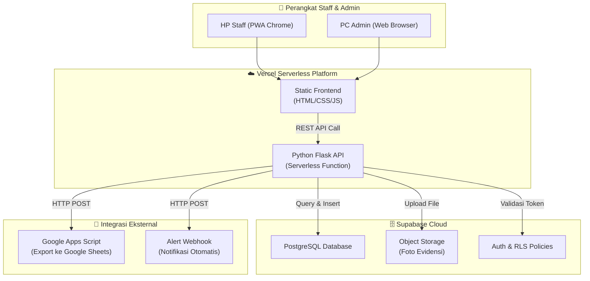
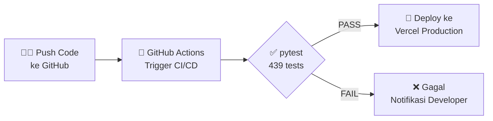

# Panduan Presentasi Tugas Akhir: Sistem Manajemen QC & Ketertelusuran

Dokumen ini disusun sebagai catatan referensi terperinci untuk membantu Anda mempelajari seluruh isi folder `Project_QC`, memahami fungsi teknisnya, dan mempersiapkan materi presentasi sidang Tugas Akhir (TA) secara profesional dan meyakinkan.

---

## 💡 Strategi Pemanfaatan Berkas untuk Sidang
Sidang Tugas Akhir sangat menyukai visualisasi data, pengujian otomatis, dan struktur kode yang rapi. Anda dapat memanfaatkan berkas-berkas di proyek ini dengan cara berikut:
1.  **Gunakan Diagram Interaktif (Mermaid):** Buka berkas di dalam folder `docs/diagrams/` menggunakan VS Code dengan ekstensi **Markdown Preview Mermaid Support** atau salin kodenya ke [Mermaid Live Editor](https://mermaid.live/) untuk menampilkan diagram alur berkualitas tinggi di slide presentasi Anda.
2.  **Gunakan Google NotebookLM / LLM Notebook:** Unggah dokumen `.md` utama (seperti `ARCHITECTURE.md`, `PERANCANGAN_SISTEM.md`, dan panduan ini) ke **NotebookLM**. NotebookLM akan otomatis merangkum, membuat panduan belajar, serta menyimulasikan pertanyaan-pertanyaan sulit yang biasa diajukan oleh dosen penguji!
3.  **Live Demo Pengujian Otomatis:** Di depan penguji, jalankan perintah `python -m pytest` di terminal. Tunjukkan bahwa aplikasi Anda memiliki **439 skenario uji (automated tests)** yang semuanya lulus (100% PASS). Ini adalah poin plus yang sangat besar karena membuktikan sistem Anda stabil, aman dari bug, dan ditulis dengan standar industri.

---

## 📂 Struktur Folder & Kegunaannya

Berikut adalah peta jalan folder proyek `Project_QC` beserta penjelasan fungsi masing-masing komponen:

```text
Project_QC/
├── api/                  # Entrypoint untuk deployment Serverless di Vercel
├── backend/              # Logika Server Utama (Python Flask API)
│   ├── core/             # Konfigurasi inti dan Dependency Injection (DI)
│   ├── models/           # Definisi struktur data (PostgreSQL Schema)
│   ├── routes/           # Penanganan endpoint API (request & response)
│   └── services/         # Bisnis logika utama (validasi, kalkulasi, ekspor)
├── frontend/             # Antarmuka Pengguna (PWA Static Web App)
│   ├── admin/            # Dashboard manajemen operasional & ekspor
│   ├── staff/            # Dashboard HP staff (monitoring suhu, input QC)
│   ├── js/               # Logika frontend (hybrid camera picker, Speed Dial)
│   ├── styles/           # CSS Styling (desain kaca/glassmorphism, responsif)
│   └── sw.js             # Service Worker untuk dukungan offline (caching)
├── supabase/             # Skema & Inisialisasi Database
│   ├── migrations/       # File SQL pembentuk tabel database
│   └── seed/             # File SQL pengisi data demo uji coba
├── tests/                # 83 file pytest (439 test cases unit & integrasi)
└── docs/                 # Dokumentasi visual sistem
    └── diagrams/         # Diagram alur sistem berbasis kode Mermaid
```

---

## 🔍 Penjelasan Detail File & Komponen Penting

### 1. API Gateway & Integrasi Cloud (`api/` & `backend/`)
*   **[api/app.py](file:///c:/Users/rio/.gemini/antigravity/scratch/Project_QC/api/app.py):** Berkas pembungkus (wrapper) minimalis agar Vercel dapat mendistribusikan aplikasi Flask Python sebagai fungsi serverless tanpa perlu mengelola server fisik secara manual.
*   **[backend/models/](file:///c:/Users/rio/.gemini/antigravity/scratch/Project_QC/backend/models/):** Jika penguji menanyakan bagaimana tabel database direpresentasikan di backend, tunjukkan berkas-berkas di sini (seperti `facility_log.py` atau `qc_report.py`). Mereka mendefinisikan tipe data PostgreSQL secara aman.
*   **[backend/services/monitoring_schedule_service.py](file:///c:/Users/rio/.gemini/antigravity/scratch/Project_QC/backend/services/monitoring_schedule_service.py):** Bisnis logika untuk jadwal monitoring harian. Berkas ini bertugas memeriksa apakah staff menginput data pada slot yang benar (07:00, 13:00, 16:00, 19:00), menghitung progress penyelesaian, dan memvalidasi apakah pengukuran ulang (recheck) diperbolehkan.

### 2. Antarmuka HP Staff & Optimalisasi Lapangan (`frontend/`)
*   **[frontend/sw.js](file:///c:/Users/rio/.gemini/antigravity/scratch/Project_QC/frontend/sw.js) & [frontend/manifest.json](file:///c:/Users/rio/.gemini/antigravity/scratch/Project_QC/frontend/manifest.json):** Menjadikan sistem ini sebagai **Progressive Web App (PWA)**. Aplikasi bisa diinstal langsung di layar HP staff dan memiliki mekanisme cache *Network-First* agar tetap dapat diakses di sudut dapur yang sulit sinyal internet.
*   **[frontend/js/ui-mobile.js](file:///c:/Users/rio/.gemini/antigravity/scratch/Project_QC/frontend/js/ui-mobile.js):** Mengontrol laci popup bawah (bottom sheet) untuk pemilihan foto. Jika staff memilih kamera, berkas ini memanipulasi DOM secara synchronous untuk memicu kamera HP secara instan (menghapus atribut `multiple` dan menyisipkan `capture="environment"`). Jika memilih galeri, atribut tersebut dikembalikan agar staff bisa memilih berkas foto dari penyimpanan lokal.
*   **[frontend/js/quick-actions.js](file:///c:/Users/rio/.gemini/antigravity/scratch/Project_QC/frontend/js/quick-actions.js):** Mengontrol tombol pintas melayang (Speed Dial FAB). Berkas ini secara cerdas mendeteksi halaman aktif untuk menyembunyikan navigasi berulang, serta menangani redirect otomatis untuk membuka laci input kendala (QC Temuan) langsung di dashboard utama.

### 3. Skema Data & Database (`supabase/`)
*   **[supabase/migrations/](file:///c:/Users/rio/.gemini/antigravity/scratch/Project_QC/supabase/migrations/):** Kumpulan berkas SQL yang membentuk struktur relasi database Supabase PostgreSQL. Sangat bagus untuk menunjukkan evolusi pembuatan tabel dari awal hingga siap pakai.
*   **[supabase/seed/001_demo_seed.sql](file:///c:/Users/rio/.gemini/antigravity/scratch/Project_QC/supabase/seed/001_demo_seed.sql):** File SQL yang berisi skrip data tiruan (mock data) seperti akun login staf, data log suhu, dan laporan QC. Berguna untuk mereset database agar aplikasi langsung siap dipresentasikan dengan data demo yang terlihat nyata di dashboard.

### 4. Dokumentasi Cetak & Spesifikasi Sistem (Root)
*   **[USER_MANUAL.md](file:///c:/Users/rio/.gemini/antigravity/scratch/Project_QC/USER_MANUAL.md):** Manual panduan operasional dalam bahasa Indonesia. Cocok dilampirkan sebagai dokumen petunjuk penggunaan pada lampiran Buku TA/Skripsi Anda.
*   **[ARCHITECTURE.md](file:///c:/Users/rio/.gemini/antigravity/scratch/Project_QC/ARCHITECTURE.md) & [PERANCANGAN_SISTEM.md](file:///c:/Users/rio/.gemini/antigravity/scratch/Project_QC/PERANCANGAN_SISTEM.md):** Memuat arsitektur sistem, keamanan JWT, diagram blok data flow, serta rancangan relasi tabel. Gunakan ini sebagai bahan utama penulisan **Bab III (Analisis dan Perancangan)** dan **Bab IV (Implementasi)** pada Buku Tugas Akhir Anda.
*   **[BLACK_BOX_TESTING.md](file:///c:/Users/rio/.gemini/antigravity/scratch/Project_QC/BLACK_BOX_TESTING.md):** Berisi matriks pengujian fungsionalitas sistem lengkap dengan input kriteria, langkah pengujian, ekspektasi, hasil aktual, dan status PASS. Ini sangat berguna untuk disalin ke **Bab V (Pengujian dan Evaluasi)** Buku TA Anda.

---

## 📊 Kasus Tabel & Visualisasi yang Perlu Ditunjukkan Saat Sidang

Berikut adalah daftar file visual dan tabel studi kasus yang sangat direkomendasikan untuk Anda buka selama presentasi atau demo aplikasi:

| Nama Visualisasi / Tabel | Lokasi Berkas | Kegunaan dalam Sidang |
| :--- | :--- | :--- |
| **Use Case Diagram** | [USE_CASE_DIAGRAM.md](file:///c:/Users/rio/.gemini/antigravity/scratch/Project_QC/docs/diagrams/USE_CASE_DIAGRAM.md) | Menjelaskan batasan sistem dan hak akses fitur antara Admin, Staff, dan System. |
| **Activity Diagram (Suhu Harian & QC)** | [ACTIVITY_DIAGRAM.md](file:///c:/Users/rio/.gemini/antigravity/scratch/Project_QC/docs/diagrams/ACTIVITY_DIAGRAM.md) | Menunjukkan alur input data, pengambilan foto hibrida, validasi recheck, dan redirect menu FAB. |
| **Entity Relationship Diagram (ERD)** | [ERD.md](file:///c:/Users/rio/.gemini/antigravity/scratch/Project_QC/docs/diagrams/ERD.md) | Menunjukkan relasi data master produk ke batch masak, laporan QC, temuan kendala, dan jejak audit. |
| **Matriks Pengujian Black Box** | [BLACK_BOX_TESTING.md](file:///c:/Users/rio/.gemini/antigravity/scratch/Project_QC/BLACK_BOX_TESTING.md) | Tabel berisi 120 skenario uji coba fungsionalitas sistem (autentikasi, monitoring, ekspor, dll.) dengan status kelulusan 100% PASS. |
| **Daftar Endpoint API REST** | [API_REFERENCE.md](file:///c:/Users/rio/.gemini/antigravity/scratch/Project_QC/API_REFERENCE.md) | Menunjukkan format payload JSON request/response HTTP untuk membuktikan kekuatan integrasi API sistem. |

---

## 🎯 Contoh Pertanyaan Penguji Sidang TA & Rekomendasi Jawaban

*   **Tanya: "Bagaimana sistem Anda mencegah staff memanipulasi data monitoring suhu?"**
    *   *Jawab:* "Sistem ini menggunakan fitur pencatatan **Audit Trail** otomatis (didokumentasikan pada `ARCHITECTURE.md` bagian 4 & `PERANCANGAN_SISTEM.md` tabel `AUDIT_LOGS`). Setiap kali data suhu diubah atau diinput kembali (recheck), sistem akan secara otomatis merekam data historis sebelumnya lengkap dengan stempel waktu (timestamp) dan alamat IP pengirim di database secara non-destructive (tidak menimpa log lama)."
*   **Tanya: "Bagaimana PWA Anda bisa berjalan secara offline di area dapur?"**
    *   *Jawab:* "Kami mengimplementasikan **Service Worker** (`frontend/sw.js`) dengan strategi caching *Network-First*. Aset statis seperti file HTML, CSS, dan JS disimpan di penyimpanan cache lokal browser HP staff. Ketika jaringan internet dapur terputus, aplikasi tetap memuat halaman antarmuka lokal secara lancar."
*   **Tanya: "Kenapa Anda menghapus pustaka Node.js (node_modules) dari repositori produksi?"**
    *   *Jawab:* "Demi optimalisasi ukuran repositori dan efisiensi deployment serverless. Aplikasi web ini berjalan menggunakan arsitektur web modern yang memisahkan client dan server secara bersih. Backend utama berbasis Python Flask, sedangkan frontend menggunakan Vanilla JS statis yang memuat library pendukung secara langsung melalui CDN pihak ketiga, sehingga repositori tidak memerlukan overhead Node.js (~24MB+) dalam pelacakan Git."
*   **Tanya: "Apa perbedaan antara QC Check dan QC Temuan di sistem ini?"**
    *   *Jawab:* "**QC Check** adalah proses inspeksi rutin dan terstruktur di mana staff mengukur parameter kualitas produk (suhu, pH, brix, TDS) pada setiap tahap produksi — mulai dari bahan baku masuk hingga produk jadi. Sedangkan **QC Temuan** adalah laporan insidental yang digunakan ketika staff menemukan anomali atau masalah di lapangan (misalnya kemasan bocor, kontaminasi, atau peralatan rusak). QC Check bersifat *scheduled*, QC Temuan bersifat *event-driven*."
*   **Tanya: "Kenapa sistem monitoring harian menggunakan 4 slot waktu tetap (07, 13, 16, 19)?"**
    *   *Jawab:* "Empat slot tersebut didesain berdasarkan kebutuhan operasional industri pangan, yaitu memantau suhu di titik-titik kritis harian: **pagi saat operasional dimulai**, **siang setelah jam istirahat**, **sore menjelang pergantian shift**, dan **malam sebelum operasional berakhir**. Sistem memvalidasi agar staff hanya bisa mengisi slot yang waktunya sudah lewat atau sedang berjalan, tetapi tidak bisa mengisi slot di masa depan — ini menjaga integritas data kronologis."
*   **Tanya: "Bagaimana sistem Anda menangani concurrency jika dua staff menginput data bersamaan?"**
    *   *Jawab:* "Backend menggunakan validasi *server-side* di layer service (`inspection_service.py` dan `monitoring_service.py`). Setiap request divalidasi terhadap state database terkini sebelum insert dilakukan. Untuk inspeksi QC, sistem juga menyimpan riwayat concurrency di tabel khusus (`qc_concurrency_history`) agar admin bisa melihat jika ada tabrakan data."
*   **Tanya: "Bagaimana jaminan keamanan autentikasi di sistem ini?"**
    *   *Jawab:* "Sistem menggunakan **JWT (JSON Web Token)** dengan masa berlaku access token 8 jam dan refresh token 14 hari. Endpoint dilindungi oleh middleware `auth_middleware.py` yang memverifikasi token di setiap request. Selain itu, sistem menerapkan **rate limiting** untuk login (maksimal 5 percobaan dalam 15 menit) guna mencegah serangan brute-force. Semua secret key disimpan di environment variable, bukan di source code."

---

## 🛠️ Peta Teknologi (Tech Stack)

Berikut adalah ringkasan teknologi yang digunakan di proyek ini, siap Anda tampilkan di slide presentasi:

| Layer | Teknologi | Versi | Fungsi |
| :--- | :--- | :--- | :--- |
| **Backend Framework** | Python Flask | 3.0.0 | Menangani seluruh endpoint REST API |
| **Database** | Supabase (PostgreSQL) | Cloud | Penyimpanan data terstruktur (relasional) |
| **Autentikasi** | PyJWT | 2.8.0 | Token berbasis JSON Web Token (JWT) |
| **Validasi Data** | Pydantic | 2.7.4 | Validasi tipe data request/response |
| **HTTP Client** | httpx | 0.27.0 | Komunikasi async ke API eksternal |
| **Penyimpanan File** | Supabase Storage | Cloud | Upload & hosting foto evidensi QC |
| **Frontend** | Vanilla HTML/CSS/JS | ES6+ | Antarmuka responsif tanpa framework berat |
| **Desain CSS** | Glassmorphism + Grid | CSS3 | Efek kaca modern dan layout adaptif |
| **PWA** | Service Worker + Manifest | - | Instalasi di HP, cache offline |
| **CI/CD** | GitHub Actions | - | Otomatisasi pengujian & deployment |
| **Hosting** | Vercel Serverless | - | Deployment tanpa server fisik |
| **Pengujian** | pytest + pytest-cov | 7.4.3 | 439 test cases otomatis |
| **Monitoring** | prometheus_client | 0.16.0 | Metrik performa server |
| **Integrasi Ekspor** | Google Apps Script | - | Sinkronisasi data ke Google Sheets |

---

## 🏗️ Arsitektur Deployment

Berikut diagram arsitektur end-to-end yang bisa Anda salin ke slide atau buka di [Mermaid Live Editor](https://mermaid.live/):



---

## 📁 Referensi File Per Komponen (Cheat Sheet)

### Backend — Berkas Kunci (`backend/`)

| Berkas | Ukuran | Fungsi Utama |
| :--- | ---: | :--- |
| [__init__.py](file:///c:/Users/rio/.gemini/antigravity/scratch/Project_QC/backend/__init__.py) | 9 KB | Entry point Flask app, registrasi seluruh blueprint route & middleware |
| [app.py](file:///c:/Users/rio/.gemini/antigravity/scratch/Project_QC/backend/app.py) | <1 KB | Wrapper ringan untuk Vercel serverless |

#### `backend/services/` — Otak Bisnis Logika

| Berkas | Ukuran | Fungsi Utama |
| :--- | ---: | :--- |
| [admin_service.py](file:///c:/Users/rio/.gemini/antigravity/scratch/Project_QC/backend/services/admin_service.py) | 104 KB | Pengelolaan dashboard admin, ekspor laporan harian, persetujuan batch |
| [inspection_service.py](file:///c:/Users/rio/.gemini/antigravity/scratch/Project_QC/backend/services/inspection_service.py) | 39 KB | Logika QC Check — validasi parameter suhu/pH/brix/TDS per tahap masak |
| [monitoring_service.py](file:///c:/Users/rio/.gemini/antigravity/scratch/Project_QC/backend/services/monitoring_service.py) | 24 KB | Input dan query monitoring suhu harian |
| [monitoring_schedule_service.py](file:///c:/Users/rio/.gemini/antigravity/scratch/Project_QC/backend/services/monitoring_schedule_service.py) | 13 KB | Validasi slot waktu (07, 13, 16, 19), progress, dan aturan recheck |
| [batch_service.py](file:///c:/Users/rio/.gemini/antigravity/scratch/Project_QC/backend/services/batch_service.py) | 18 KB | Pembuatan batch masak baru, validasi kode batch unik |
| [qc_service.py](file:///c:/Users/rio/.gemini/antigravity/scratch/Project_QC/backend/services/qc_service.py) | 12 KB | Pengelolaan laporan QC Temuan (insidental) |
| [storage_service.py](file:///c:/Users/rio/.gemini/antigravity/scratch/Project_QC/backend/services/storage_service.py) | 7 KB | Upload foto evidensi ke Supabase Storage bucket |
| [google_apps_script_service.py](file:///c:/Users/rio/.gemini/antigravity/scratch/Project_QC/backend/services/google_apps_script_service.py) | 15 KB | Sinkronisasi data QC ke Google Sheets via webhook |
| [auth_service.py](file:///c:/Users/rio/.gemini/antigravity/scratch/Project_QC/backend/services/auth_service.py) | 3 KB | Generate & validasi JWT access/refresh token |
| [audit_service.py](file:///c:/Users/rio/.gemini/antigravity/scratch/Project_QC/backend/services/audit_service.py) | 3 KB | Pencatatan audit trail otomatis (siapa mengubah apa, kapan) |
| [dashboard_service.py](file:///c:/Users/rio/.gemini/antigravity/scratch/Project_QC/backend/services/dashboard_service.py) | 11 KB | Agregasi data statistik untuk tampilan dashboard ringkasan |
| [request_validation.py](file:///c:/Users/rio/.gemini/antigravity/scratch/Project_QC/backend/services/request_validation.py) | 7 KB | Validasi ukuran file, tipe MIME, dan sanitasi input |

---

### Frontend — Berkas Kunci (`frontend/js/`)

| Berkas | Ukuran | Fungsi Utama |
| :--- | ---: | :--- |
| [admin_app.js](file:///c:/Users/rio/.gemini/antigravity/scratch/Project_QC/frontend/js/admin_app.js) | 247 KB | Seluruh logika antarmuka dashboard admin (tabel, grafik, ekspor) |
| [inspection.js](file:///c:/Users/rio/.gemini/antigravity/scratch/Project_QC/frontend/js/inspection.js) | 144 KB | Logika antarmuka QC Check — form multi-tahap, barcode, foto evidensi |
| [monitoring.js](file:///c:/Users/rio/.gemini/antigravity/scratch/Project_QC/frontend/js/monitoring.js) | 47 KB | Antarmuka input suhu harian per slot waktu |
| [dashboard.js](file:///c:/Users/rio/.gemini/antigravity/scratch/Project_QC/frontend/js/dashboard.js) | 37 KB | Halaman utama staff — ringkasan hari ini, navigasi cepat |
| [api.js](file:///c:/Users/rio/.gemini/antigravity/scratch/Project_QC/frontend/js/api.js) | 24 KB | Wrapper `fetch()` terpusat — menangani JWT, retry, error handling |
| [profile.js](file:///c:/Users/rio/.gemini/antigravity/scratch/Project_QC/frontend/js/profile.js) | 15 KB | Halaman profil pengguna dan pengaturan akun |
| [camera-module.js](file:///c:/Users/rio/.gemini/antigravity/scratch/Project_QC/frontend/js/camera-module.js) | 11 KB | Modul kamera hybrid — MediaStream API untuk akses kamera langsung |
| [ui-mobile.js](file:///c:/Users/rio/.gemini/antigravity/scratch/Project_QC/frontend/js/ui-mobile.js) | 10 KB | Bottom sheet picker (pilihan Kamera / Galeri), manipulasi DOM |
| [quick-actions.js](file:///c:/Users/rio/.gemini/antigravity/scratch/Project_QC/frontend/js/quick-actions.js) | 5 KB | Speed Dial FAB — navigasi cepat antar fitur dari tombol `+` |
| [auth.js](file:///c:/Users/rio/.gemini/antigravity/scratch/Project_QC/frontend/js/auth.js) | 5 KB | Halaman login, pengelolaan session JWT di localStorage |
| [image-compression.js](file:///c:/Users/rio/.gemini/antigravity/scratch/Project_QC/frontend/js/image-compression.js) | 3 KB | Kompresi gambar di sisi client sebelum upload ke server |

---

## 🗄️ Timeline Evolusi Database (Migrasi SQL)

Tabel berikut menunjukkan bagaimana database berkembang seiring waktu. Ini sangat baik untuk menunjukkan **proses iterasi pengembangan** kepada penguji:

| No. | File Migrasi | Isi Perubahan |
| :---: | :--- | :--- |
| 001 | [001_production_schema.sql](file:///c:/Users/rio/.gemini/antigravity/scratch/Project_QC/supabase/migrations/001_production_schema.sql) | Pembuatan skema awal: tabel produk, staff, batch masak, laporan QC |
| 002 | [002_fix_temperature_logs_column.sql](file:///c:/Users/rio/.gemini/antigravity/scratch/Project_QC/supabase/migrations/002_fix_temperature_logs_column.sql) | Perbaikan struktur kolom log suhu |
| 003 | [003_storage_qc_evidence.sql](file:///c:/Users/rio/.gemini/antigravity/scratch/Project_QC/supabase/migrations/003_storage_qc_evidence.sql) | Penambahan bucket penyimpanan foto evidensi QC |
| 004 | [004_dashboard_real_data.sql](file:///c:/Users/rio/.gemini/antigravity/scratch/Project_QC/supabase/migrations/004_dashboard_real_data.sql) | View dan query untuk data dashboard real-time |
| 006 | [006_massive_qc_fix.sql](file:///c:/Users/rio/.gemini/antigravity/scratch/Project_QC/supabase/migrations/006_massive_qc_fix.sql) | Perbaikan besar relasi tabel QC Check |
| 007 | [007_facility_rooms_devices_fix.sql](file:///c:/Users/rio/.gemini/antigravity/scratch/Project_QC/supabase/migrations/007_facility_rooms_devices_fix.sql) | Restrukturisasi fasilitas → ruang → perangkat (hierarki 3 tingkat) |
| 014 | [014_qc_check_cooking_final_flow.sql](file:///c:/Users/rio/.gemini/antigravity/scratch/Project_QC/supabase/migrations/014_qc_check_cooking_final_flow.sql) | Alur inspeksi multi-tahap masak (bahan baku → proses → produk jadi) |
| 015 | [015_optional_batch_ph_brix_tds.sql](file:///c:/Users/rio/.gemini/antigravity/scratch/Project_QC/supabase/migrations/015_optional_batch_ph_brix_tds.sql) | Parameter opsional pH, Brix, TDS pada batch |
| 019 | [019_daily_monitoring_schedule.sql](file:///c:/Users/rio/.gemini/antigravity/scratch/Project_QC/supabase/migrations/019_daily_monitoring_schedule.sql) | Tabel jadwal monitoring harian 4 slot waktu |
| 023 | [023_qc_concurrency_history.sql](file:///c:/Users/rio/.gemini/antigravity/scratch/Project_QC/supabase/migrations/023_qc_concurrency_history.sql) | Riwayat concurrency untuk mendeteksi tabrakan data |
| 025 | [025_create_announcements_table.sql](file:///c:/Users/rio/.gemini/antigravity/scratch/Project_QC/supabase/migrations/025_create_announcements_table.sql) | Tabel pengumuman admin ke staff |
| 027 | [027_add_profile_fields.sql](file:///c:/Users/rio/.gemini/antigravity/scratch/Project_QC/supabase/migrations/027_add_profile_fields.sql) | Penambahan field profil pengguna (avatar, bio) |

> **💡 Tips Presentasi:** Tunjukkan bahwa proyek ini melalui **27 iterasi migrasi database**, yang membuktikan proses pengembangan bertahap, bukan sekali jadi. Ini mencerminkan metodologi *Agile/Iterative Development* yang sesungguhnya.

---

## 🧪 Rincian Cakupan Pengujian Otomatis

Proyek ini memiliki **83 file test** yang mencakup **439 skenario uji**. Berikut kategorisasinya:

| Kategori Pengujian | Jumlah File | Contoh File Test | Cakupan |
| :--- | :---: | :--- | :--- |
| **Autentikasi & Otorisasi** | 4 | [test_auth.py](file:///c:/Users/rio/.gemini/antigravity/scratch/Project_QC/tests/test_auth.py), [test_auth_roles.py](file:///c:/Users/rio/.gemini/antigravity/scratch/Project_QC/tests/test_auth_roles.py) | Login, JWT, hak akses role |
| **Dashboard & Reporting Admin** | 12 | [test_admin_dashboard_final.py](file:///c:/Users/rio/.gemini/antigravity/scratch/Project_QC/tests/test_admin_dashboard_final.py), [test_admin_reporting.py](file:///c:/Users/rio/.gemini/antigravity/scratch/Project_QC/tests/test_admin_reporting.py) | Statistik, ekspor harian, persetujuan batch |
| **Monitoring Suhu Harian** | 7 | [test_monitoring_schedule.py](file:///c:/Users/rio/.gemini/antigravity/scratch/Project_QC/tests/test_monitoring_schedule.py), [test_monitoring.py](file:///c:/Users/rio/.gemini/antigravity/scratch/Project_QC/tests/test_monitoring.py) | Slot waktu, validasi duplikat, recheck |
| **QC Check (Inspeksi)** | 10 | [test_qc_check_cooking_final_flow.py](file:///c:/Users/rio/.gemini/antigravity/scratch/Project_QC/tests/test_qc_check_cooking_final_flow.py), [test_inspection_mobile_ux.py](file:///c:/Users/rio/.gemini/antigravity/scratch/Project_QC/tests/test_inspection_mobile_ux.py) | Multi-tahap masak, UX mobile, submit |
| **QC Temuan (Findings)** | 5 | [test_qc_findings.py](file:///c:/Users/rio/.gemini/antigravity/scratch/Project_QC/tests/test_qc_findings.py), [test_staff_qc_temuan_quick_report.py](file:///c:/Users/rio/.gemini/antigravity/scratch/Project_QC/tests/test_staff_qc_temuan_quick_report.py) | Laporan insidental, quick report |
| **Batch & Produk** | 5 | [test_batch_create.py](file:///c:/Users/rio/.gemini/antigravity/scratch/Project_QC/tests/test_batch_create.py), [test_admin_products.py](file:///c:/Users/rio/.gemini/antigravity/scratch/Project_QC/tests/test_admin_products.py) | CRUD produk, validasi batch |
| **Fasilitas & Perangkat** | 4 | [test_facility_rooms_devices.py](file:///c:/Users/rio/.gemini/antigravity/scratch/Project_QC/tests/test_facility_rooms_devices.py) | Hierarki fasilitas-ruang-perangkat |
| **Upload & Storage** | 3 | [test_storage_service.py](file:///c:/Users/rio/.gemini/antigravity/scratch/Project_QC/tests/test_storage_service.py), [test_photo_upload_flow.py](file:///c:/Users/rio/.gemini/antigravity/scratch/Project_QC/tests/test_photo_upload_flow.py) | Upload foto, kompresi, validasi MIME |
| **Integrasi Google Sheets** | 2 | [test_google_apps_script_integration.py](file:///c:/Users/rio/.gemini/antigravity/scratch/Project_QC/tests/test_google_apps_script_integration.py) | Webhook ekspor data ke spreadsheet |
| **Frontend Config & UX** | 6 | [test_frontend_config.py](file:///c:/Users/rio/.gemini/antigravity/scratch/Project_QC/tests/test_frontend_config.py), [test_global_modal_ux.py](file:///c:/Users/rio/.gemini/antigravity/scratch/Project_QC/tests/test_global_modal_ux.py) | Konsistensi UI, modal dialog, navigasi |
| **Production Hardening** | 4 | [test_task4_production_hardening.py](file:///c:/Users/rio/.gemini/antigravity/scratch/Project_QC/tests/test_task4_production_hardening.py) | Keamanan produksi, health check |
| **End-to-End Staff↔Admin** | 6 | [test_task3_monitoring_staff_to_admin.py](file:///c:/Users/rio/.gemini/antigravity/scratch/Project_QC/tests/test_task3_monitoring_staff_to_admin.py) | Alur lengkap dari input staff sampai laporan admin |

> **💡 Tips Presentasi:** Saat demo, jalankan `python -m pytest --tb=short` di terminal dan tunjukkan output **439 passed** berwarna hijau. Jika penguji bertanya "bagaimana Anda memastikan sistem ini sudah teruji?", arahkan ke tabel di atas.

---

## ⚙️ CI/CD Pipeline (Otomatisasi Deploy)

Proyek ini menggunakan **GitHub Actions** untuk otomatisasi. Berikut penjelasan 2 workflow yang tersedia:

| Workflow | Berkas | Fungsi |
| :--- | :--- | :--- |
| **CI/CD Production** | [ci-cd-production.yml](file:///c:/Users/rio/.gemini/antigravity/scratch/Project_QC/.github/workflows/ci-cd-production.yml) | Menjalankan pytest otomatis setiap kali ada push/PR ke branch `main`, lalu deploy ke Vercel jika semua test lulus |
| **Supabase Preview** | [supabase-preview.yml](file:///c:/Users/rio/.gemini/antigravity/scratch/Project_QC/.github/workflows/supabase-preview.yml) | Membuat preview branch database Supabase untuk pengujian migrasi SQL sebelum merge |



---

## 📚 Rekomendasi File untuk Diunggah ke NotebookLM / LLM Notebook

Jika Anda ingin menggunakan **Google NotebookLM** untuk belajar dan berlatih menjawab pertanyaan penguji, unggah file-file berikut secara berurutan:

| Prioritas | File yang Diunggah | Alasan |
| :---: | :--- | :--- |
| 🔴 1 | `PANDUAN_PRESENTASI_TA.md` (file ini) | Peta lengkap proyek, referensi cepat, dan latihan Q&A |
| 🔴 2 | `PERANCANGAN_SISTEM.md` | Diagram alur, skema database, dan arsitektur lengkap |
| 🟡 3 | `ARCHITECTURE.md` | Penjelasan teknis arsitektur, keamanan, dan PWA |
| 🟡 4 | `USER_MANUAL.md` | Panduan operasional dari perspektif pengguna |
| 🟢 5 | `BLACK_BOX_TESTING.md` | 120 skenario pengujian fungsional lengkap |
| 🟢 6 | `API_REFERENCE.md` | Daftar endpoint API beserta contoh payload |
| 🟢 7 | `DATABASE_SCHEMA.md` | Dokumentasi skema tabel database detail |
| 🟢 8 | `BUSINESS_REQUIREMENTS.md` | Kebutuhan bisnis & fungsional sistem |

> **💡 Tips NotebookLM:** Setelah mengunggah semua file, minta NotebookLM untuk:
> 1. *"Buatkan 20 pertanyaan sidang Tugas Akhir yang paling sulit tentang sistem ini."*
> 2. *"Jelaskan arsitektur sistem ini seolah-olah kamu sedang presentasi di depan dosen penguji."*
> 3. *"Apa kelemahan atau limitasi dari sistem ini? Bagaimana cara menjawabnya jika ditanya penguji?"*

---

## 🗺️ Pemetaan Bab Buku TA ↔ Berkas Proyek

Jika Anda sedang menulis Buku Tugas Akhir, berikut pemetaan isi bab ke berkas proyek yang relevan:

| Bab Buku TA | Berkas Referensi yang Relevan |
| :--- | :--- |
| **Bab I — Pendahuluan** | [BUSINESS_REQUIREMENTS.md](file:///c:/Users/rio/.gemini/antigravity/scratch/Project_QC/BUSINESS_REQUIREMENTS.md) (latar belakang, rumusan masalah) |
| **Bab II — Tinjauan Pustaka** | [README.md](file:///c:/Users/rio/.gemini/antigravity/scratch/Project_QC/README.md) (daftar teknologi), `requirements.txt` (pustaka Python) |
| **Bab III — Analisis & Perancangan** | [PERANCANGAN_SISTEM.md](file:///c:/Users/rio/.gemini/antigravity/scratch/Project_QC/PERANCANGAN_SISTEM.md), [ERD.md](file:///c:/Users/rio/.gemini/antigravity/scratch/Project_QC/docs/diagrams/ERD.md), [USE_CASE_DIAGRAM.md](file:///c:/Users/rio/.gemini/antigravity/scratch/Project_QC/docs/diagrams/USE_CASE_DIAGRAM.md), [ACTIVITY_DIAGRAM.md](file:///c:/Users/rio/.gemini/antigravity/scratch/Project_QC/docs/diagrams/ACTIVITY_DIAGRAM.md), [SEQUENCE_DIAGRAM.md](file:///c:/Users/rio/.gemini/antigravity/scratch/Project_QC/docs/diagrams/SEQUENCE_DIAGRAM.md) |
| **Bab IV — Implementasi** | [ARCHITECTURE.md](file:///c:/Users/rio/.gemini/antigravity/scratch/Project_QC/ARCHITECTURE.md), [API_REFERENCE.md](file:///c:/Users/rio/.gemini/antigravity/scratch/Project_QC/API_REFERENCE.md), [DATABASE_SCHEMA.md](file:///c:/Users/rio/.gemini/antigravity/scratch/Project_QC/DATABASE_SCHEMA.md), [DEPLOYMENT_GUIDE.md](file:///c:/Users/rio/.gemini/antigravity/scratch/Project_QC/DEPLOYMENT_GUIDE.md) |
| **Bab V — Pengujian & Evaluasi** | [BLACK_BOX_TESTING.md](file:///c:/Users/rio/.gemini/antigravity/scratch/Project_QC/BLACK_BOX_TESTING.md), [TESTING_GUIDE.md](file:///c:/Users/rio/.gemini/antigravity/scratch/Project_QC/TESTING_GUIDE.md), folder `tests/` (439 automated test cases) |
| **Bab VI — Kesimpulan** | Panduan ini + hasil demo live |
| **Lampiran** | [USER_MANUAL.md](file:///c:/Users/rio/.gemini/antigravity/scratch/Project_QC/USER_MANUAL.md), [.env.example](file:///c:/Users/rio/.gemini/antigravity/scratch/Project_QC/.env.example), [vercel.json](file:///c:/Users/rio/.gemini/antigravity/scratch/Project_QC/vercel.json) |

---

## ✅ Checklist Kesiapan Sidang

Gunakan daftar periksa ini sebelum hari H presentasi:

- [ ] Pastikan aplikasi web live bisa diakses di URL Vercel
- [ ] Siapkan akun demo (admin & staff) — lihat `README.md` bagian Demo Accounts
- [ ] Buka [Mermaid Live Editor](https://mermaid.live/) dan paste kode dari `docs/diagrams/` untuk screenshot diagram
- [ ] Jalankan `python -m pytest` dan screenshot hasilnya (439 passed ✅)
- [ ] Siapkan HP untuk demo input monitoring suhu & foto kamera langsung
- [ ] Unggah file `.md` ke NotebookLM dan latih jawab pertanyaan sulit
- [ ] Cetak `BLACK_BOX_TESTING.md` sebagai lampiran bukti pengujian
- [ ] Pastikan `.env` production berisi key Supabase yang valid

