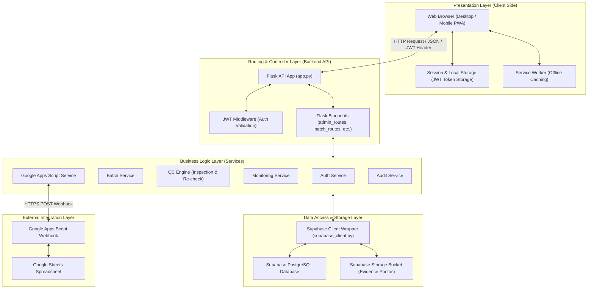
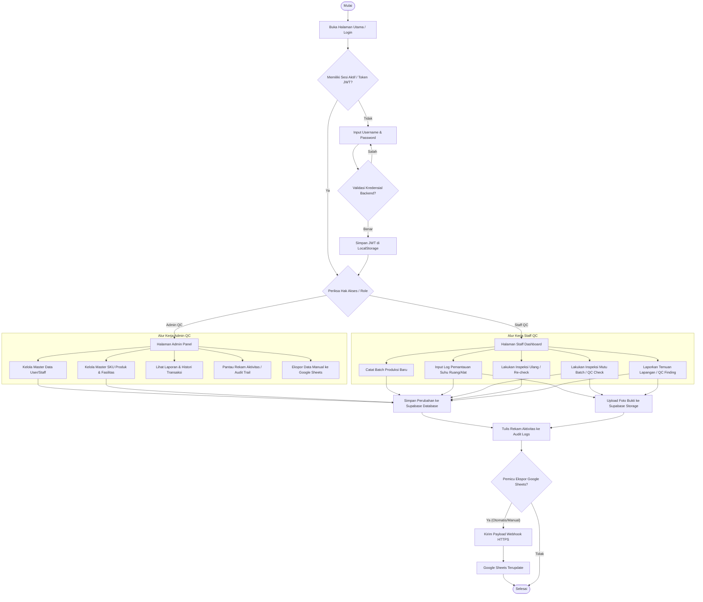
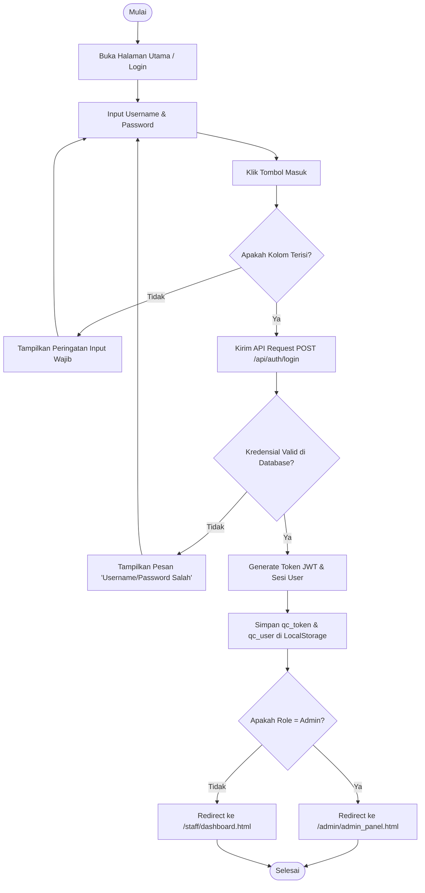
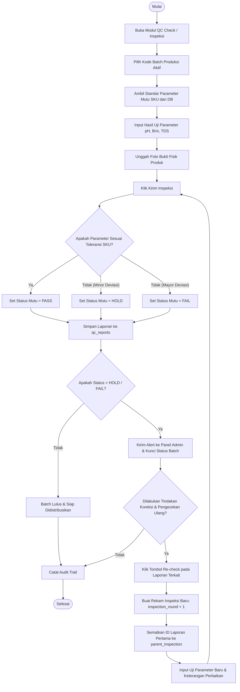
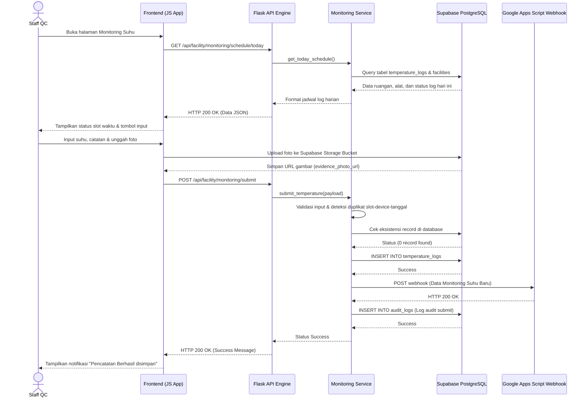
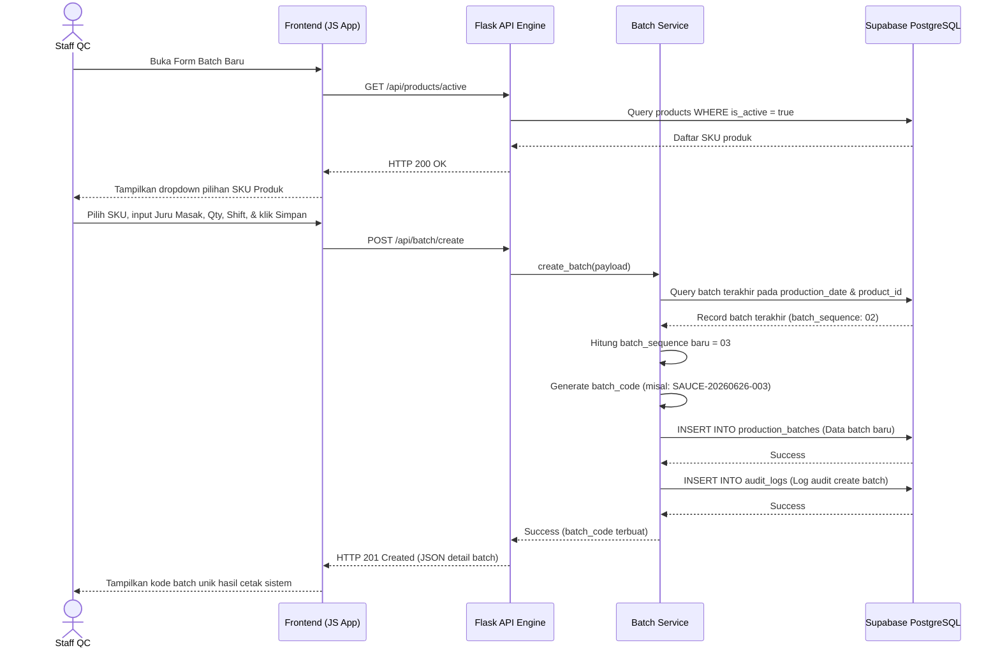
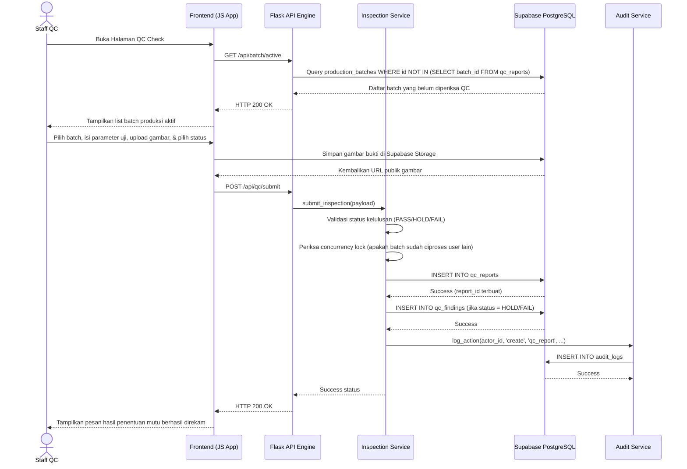
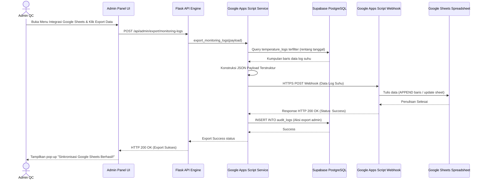
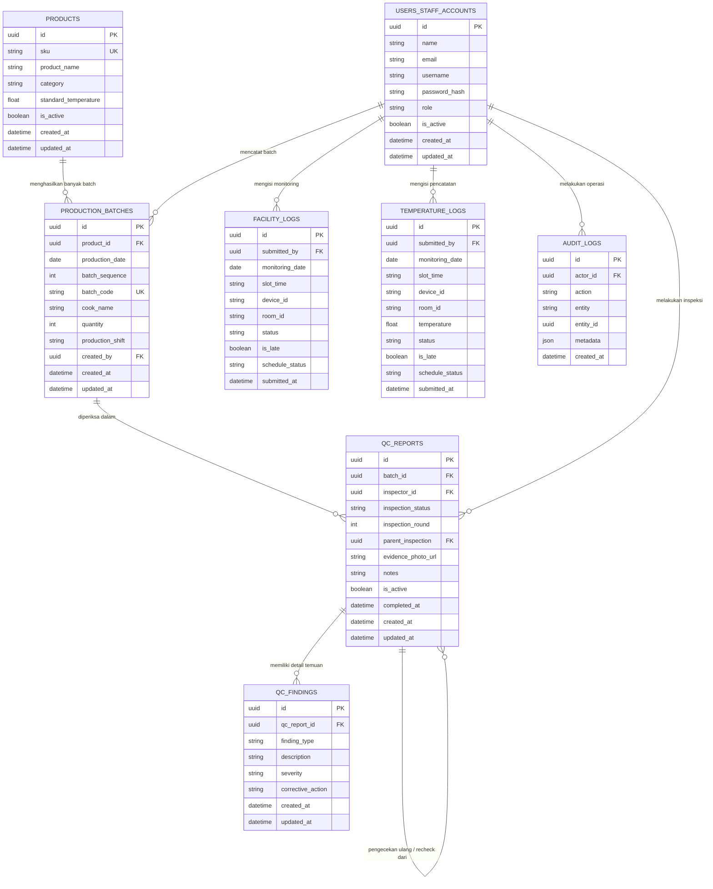

# Bab IV: Perancangan Sistem
**QC Enterprise Management System**

Dokumen ini menyajikan perancangan detail dari **QC Enterprise Management System** sebagai dokumentasi formal sistem informasi. Seluruh perancangan didasarkan pada aplikasi yang telah dibangun tanpa adanya modifikasi fungsional, database, maupun antarmuka pengguna. Perancangan ini disajikan dengan menggunakan standar pemodelan perangkat lunak modern untuk memenuhi kebutuhan dokumentasi akademis skripsi.

---

## 1. Arsitektur Sistem (System Architecture)

Sistem dirancang menggunakan arsitektur bertingkat (**Multi-Tier Architecture / Three-Tier Architecture**) dengan pemisahan tugas yang jelas antara antarmuka pengguna, logika bisnis, dan penyimpanan data.



### Deskripsi Tingkatan Arsitektur:
1. **Presentation Layer (Frontend)**: Berbasis HTML5, Vanilla CSS, dan Vanilla JavaScript dengan karakteristik *Responsive Layout* (mendukung tampilan Mobile Web dan Desktop). Menggunakan LocalStorage untuk autentikasi persisten via JWT dan Service Worker untuk mendukung mode kerja luring (*offline capability*).
2. **Routing & Controller Layer**: Menggunakan kerangka kerja **Python Flask** yang membagi fungsionalitas ke dalam modul-modul *Blueprint* (seperti `auth`, `monitoring`, `qc`, `batch`, `admin`). Dilengkapi dengan *Middleware* untuk validasi token keamanan JWT secara terpusat pada setiap *endpoint* privat.
3. **Business Logic Layer (Service Layer)**: Kumpulan kelas *Service* yang menangani aturan bisnis (*business rules*) secara khusus, seperti perhitungan runutan pembuatan kode batch (`BatchService`), validasi ambang batas parameter mutu produk (`QCEngine`), pemrosesan alarm deviasi suhu (`MonitoringService`), serta konversi payload data untuk integrasi eksternal (`GoogleAppsScriptService`).
4. **Data Access & Storage Layer**: Menggunakan **Supabase PostgreSQL** sebagai pangkalan data relasional dan **Supabase Storage** untuk menyimpan berkas foto bukti fisik inspeksi mutu (*evidence photo*). Interaksi data dibungkus menggunakan *Supabase Client Wrapper* berbasis REST.
5. **External Integration Layer**: Menggunakan *Webhook* HTTPS POST untuk mengirimkan data transaksi secara *real-time* ke **Google Apps Script** yang bertindak sebagai jembatan penulisan data langsung pada **Google Sheets**.

---

## 2. Flowchart Sistem (System Flowchart)

Flowchart sistem menggambarkan runutan alur operasional umum dari awal pengguna berinteraksi dengan aplikasi hingga terjadinya pengolahan data transaksi dan pelaporan eksternal.



---

## 3. Use Case Diagram

Use Case Diagram menggambarkan interaksi antara aktor pengguna dengan fungsionalitas sistem informasi yang disediakan oleh aplikasi.

```mermaid
flowchart LR
    Admin([Admin QC])
    Staff([Staff QC])
    System([Sistem Backend])
    GAS([Google Sheets Webhook])

    subgraph UCEnt["QC Enterprise System Boundary"]
        UC1((Login & Otentikasi))
        UC2((Kelola Akun Staf))
        UC3((Kelola Master SKU Produk))
        UC4((Kelola Layout Fasilitas & Device))
        UC5((Catat Batch Produksi))
        UC6((Catat Pemantauan Suhu Ruang))
        UC7((Input QC Inspection PASS/HOLD/FAIL))
        UC8((Input Re-check Inspeksi))
        UC9((Laporkan Temuan Mutu / QC Finding))
        UC10((Lihat Dashboard Ringkasan))
        UC11((Lihat Riwayat & Laporan))
        UC12((Lihat Audit Trail))
        UC13((Ekspor Data Google Sheets))
        
        UC16((Validasi Token JWT & Otorisasi))
        UC17((Catat Jejak Aktivitas / Audit Log))
        UC18((Kirim Notifikasi Deviasi))
    end

    Admin --> UC1
    Admin --> UC2
    Admin --> UC3
    Admin --> UC4
    Admin --> UC10
    Admin --> UC11
    Admin --> UC12
    Admin --> UC13

    Staff --> UC1
    Staff --> UC5
    Staff --> UC6
    Staff --> UC7
    Staff --> UC8
    Staff --> UC9
    Staff --> UC10
    Staff --> UC11

    UC13 -.-> GAS
    
    System --> UC16
    System --> UC17
    System --> UC18

    UC1 ..> UC16 : "<<include>>"
    UC5 ..> UC17 : "<<include>>"
    UC6 ..> UC17 : "<<include>>"
    UC7 ..> UC17 : "<<include>>"
    UC8 ..> UC17 : "<<include>>"
    UC9 ..> UC17 : "<<include>>"
    UC15 ..> UC17 : "<<include>>"
```

---

## 4. Activity Diagram

Activity Diagram merinci alur kerja dinamis sistem untuk beberapa proses bisnis yang paling krusial.

### A. Login & Penentuan Halaman (Role Redirect)
Menggambarkan bagaimana sistem memverifikasi kredensial pengguna dan mengarahkannya ke dashboard yang tepat berdasarkan hak akses (*role*).



### B. Pencatatan Pemantauan Suhu Harian (Daily Temperature Monitoring)
Menggambarkan proses pencatatan suhu ruang/chiller oleh Staff QC dengan validasi pengisian slot dan pencegahan data duplikat harian.

```mermaid
flowchart TD
    start([Mulai]) --> B[Buka Menu Pemantauan Suhu]
    B --> C[Request Jadwal Slot & Daftar Alat Hari Ini]
    C --> D[System menampilkan status Slot Pagi/Siang/Sore/Malam]
    D --> E[Pilih Ruangan & Alat target]
    E --> F[Klik Input Suhu]
    F --> G{Slot Waktu Aktif & Sesuai Toleransi?}
    G -- Tidak --> H[Tampilkan Peringatan Di luar Jam Toleransi]
    H --> ending([Selesai])
    G -- Ya --> I[Input Angka Suhu Celsius & Catatan]
    I --> J{Apakah Perlu Upload Foto Bukti?}
    J -- Ya --> K[Unggah Gambar Termometer Digital]
    K --> L[Proses Kompresi Gambar di Sisi Klien]
    L --> M[Simpan Gambar ke Supabase Storage & dapatkan URL]
    M --> N[Simpan Log Suhu via API]
    J -- Tidak --> N
    N --> O{Apakah Data Device-Slot-Tanggal Sudah Ada?}
    O -- Ya --> P[Tolak Input & Tampilkan Pesan Duplikat]
    P --> ending
    O -- -- Tidak --> Q[Simpan Log Suhu Baru ke Supabase DB]
    Q --> R{Suhu di Luar Batas Threshold Alat?}
    R -- Ya --> S[Set Status = CRITICAL & Buat Alert Entri]
    R -- Tidak --> T[Set Status = NORMAL]
    S & T --> U[Picu Webhook Sinkronisasi Google Sheets]
    U --> V[Catat Aksi ke Audit Trail]
    V --> ending
```

### C. Pembuatan Batch Produksi (Production Batch Creation)
Menggambarkan proses pencatatan proses masak harian guna menghasilkan kode unik *traceability* produk pangan.

```mermaid
flowchart TD
    start([Mulai]) --> B[Buka Form Tambah Batch Produksi]
    B --> C[Ambil Daftar SKU Produk Aktif dari Database]
    C --> D[Pilih SKU Produk]
    D --> E[Input Nama Juru Masak, Jumlah Qty, Shift Kerja]
    E --> F[Klik Simpan Batch]
    F --> G{Apakah Kolom Valid & Kuantitas > 0?}
    G -- Tidak --> H[Tampilkan Peringatan Validasi Form]
    H --> E
    G -- Ya --> I[System melakukan Query Batch Terakhir di Tanggal Terkait]
    I --> J[Kalkulasi Urutan Nomor: batch_sequence + 1]
    J --> K[Generate Kode Batch: SKU-YYYYMMDD-[Sequence]]
    K --> L{Apakah Kode Batch Unik di Database?}
    L -- Tidak --> M[Ulangi Kalkulasi Nomor Urut berikutnya]
    M --> J
    L -- Ya --> N[Simpan Data Batch ke Tabel production_batches]
    N --> O[Catat Aksi Pembuatan ke Audit Logs]
    O --> ending([Selesai])
```

### D. Inspeksi Mutu & Proses Pengecekan Ulang (QC Inspection & Re-check)
Menggambarkan alur pengambilan keputusan kelayakan produk pangan (PASS, HOLD, FAIL) dan pencatatan riwayat penanganan ulang produk.



---

## 5. Sequence Diagram

Sequence Diagram memodelkan interaksi pesan (*messages*) kronologis antar objek di dalam sistem pada skenario operasional penting.

### A. Staff QC Melakukan Submit Monitoring Suhu harian



### B. Staff QC Membuat Batch Produksi Baru



### C. Staff QC Mengirimkan QC Inspection Report



### D. Admin QC Mengekspor Data ke Google Sheets



---

## 6. Entity Relationship Diagram (ERD)

ERD di bawah ini memodelkan struktur tabel, tipe data, kunci utama (*primary key*), kunci asing (*foreign key*), serta hubungan kardinalitas relasional data pada sistem.



---

## 7. Class Diagram

Class Diagram menggambarkan komponen utama kode Python Flask di tingkat backend, mencakup pembagian controller (*API Blueprints*), komponen bisnis (*Services*), dan komponen utilitas.

```mermaid
classDiagram
    class SupabaseClient {
        +string supabase_url
        +string supabase_key
        +object client
        +query_table(table_name)
        +insert_record(table_name, data)
        +update_record(table_name, filters, data)
        +delete_record(table_name, filters)
        +upload_file(bucket_name, file_path, file_object)
    }

    class AuthService {
        +login_user(username, password)
        +validate_jwt_token(token)
        +invalidate_session(token)
    }

    class BatchService {
        +create_production_batch(product_id, cook_name, quantity, shift, user_id)
        +calculate_next_batch_sequence(product_id, date)
        +get_batch_by_code(batch_code)
        +filter_batches(filters)
    }

    class QCEngine {
        +validate_product_thresholds(sku, ph, brix, tds)
        +check_critical_control_points(temp, threshold)
    }

    class InspectionService {
        +save_qc_report(batch_id, inspector_id, status, notes, photo_url)
        +save_recheck_report(parent_id, inspector_id, status, notes, photo_url)
        +get_inspection_history(batch_id)
    }

    class MonitoringService {
        +submit_temperature_reading(device_id, room_id, temperature, slot, user_id)
        +get_today_schedule_progress()
        +get_historical_logs(filters)
    }

    class GoogleAppsScriptService {
        +sync_monitoring_data(log_data)
        +sync_inspection_data(qc_data)
        +send_webhook_request(payload)
    }

    class AuditService {
        +write_audit_log(actor_id, action, entity, entity_id, metadata)
        +list_audit_logs(filters)
    }

    class AdminService {
        +create_staff_account(username, password, name, role)
        +register_new_sku(sku, name, temp_std)
        +register_new_facility_device(device_name, type, threshold)
        +generate_dashboard_metrics()
    }

    class LearningService {
        +list_learning_modules()
        +submit_mini_quiz_answer(user_id, question_id, answer)
        +verify_certification_readiness(user_id)
        +generate_certificate(user_id, score)
    }

    %% Controller / Route Layers
    class AuthRoutes {
        +POST /api/auth/login
        +POST /api/auth/logout
    }

    class BatchRoutes {
        +POST /api/batch/create
        +GET /api/batch/next-code
        +GET /api/batch/list
    }

    class QCRoutes {
        +POST /api/qc/submit
        +POST /api/qc/recheck
        +GET /api/qc/history
    }

    class MonitoringRoutes {
        +POST /api/monitoring/submit
        +GET /api/monitoring/schedule
    }

    class AdminRoutes {
        +POST /api/admin/users
        +POST /api/admin/skus
        +POST /api/admin/export/sheets
        +GET /api/admin/audit-logs
    }

    %% Relationships
    AuthRoutes ..> AuthService : "calls"
    BatchRoutes ..> BatchService : "calls"
    QCRoutes ..> InspectionService : "calls"
    QCRoutes ..> QCEngine : "utilizes"
    MonitoringRoutes ..> MonitoringService : "calls"
    AdminRoutes ..> AdminService : "calls"
    AdminRoutes ..> GoogleAppsScriptService : "calls"

    AuthService --> SupabaseClient : "uses"
    BatchService --> SupabaseClient : "uses"
    InspectionService --> SupabaseClient : "uses"
    MonitoringService --> SupabaseClient : "uses"
    AdminService --> SupabaseClient : "uses"
    LearningService --> SupabaseClient : "uses"
    AuditService --> SupabaseClient : "uses"
```



---

## 8. Deployment Diagram

Deployment Diagram memodelkan infrastruktur fisik dan virtual tempat QC Enterprise Management System dideploy dan diakses di lingkungan produksi (*production environment*).

```mermaid
flowchart TB
    subgraph ClientDevice["Client Tier (User Hardware)"]
        PC["Web Browser (Chrome / Safari / Edge)"]
        Mobile["Mobile Web App (Installed PWA)"]
    end

    subgraph CDN["Edge & DNS Routing Tier"]
        VercelCDN["Vercel Edge Network (CDN)"]
        DNS["DNS Server / SSL Handshake"]
    end

    subgraph VercelCloud["Cloud Hosting Tier (Vercel Serverless)"]
        subgraph FEHost["Static Hosting Host"]
            HTMLStatic["HTML, CSS, Client JS"]
        end
        subgraph BEHost["Serverless Runtime"]
            FlaskRuntime["Flask Backend Application (Python 3.9+)"]
        end
    end

    subgraph DatabaseTier["Managed Backend Tier (Supabase Cloud)"]
        subgraph PostgresHost["AWS Hosted Postgres Instance"]
            PostgreSQLDB[("Supabase PostgreSQL Database")]
        end
        subgraph StorageHost["Object Storage"]
            SupaStorageBucket[("Supabase Storage (Evidence Photos)")]
        end
    end

    subgraph GoogleCloudTier["External Spreadsheet Sync Tier (Google Cloud)"]
        GASWebhook["Google Apps Script Engine"]
        GoogleSheets[("Google Sheets Spreadsheet Document")]
    end

    %% Network Connections
    PC & Mobile <-->|HTTPS / SSL| DNS
    DNS <--> VercelCDN
    VercelCDN <-->|Serve Static Assets| HTMLStatic
    VercelCDN <-->|Proxy API Requests /api/*| FlaskRuntime
    FlaskRuntime <-->|Secure PostgreSQL Link (TLS 1.3)| PostgreSQLDB
    FlaskRuntime <-->|API Multipart Form Upload| SupaStorageBucket
    FlaskRuntime <-->|HTTPS Webhook Call| GASWebhook
    GASWebhook <-->|Google internal API| GoogleSheets
```

### Keterangan Infrastruktur:
1. **Client Tier**: Perangkat keras komputer (Desktop) milik Admin/Staff QC dan perangkat seluler (Smartphone/Tablet) yang menjalankan PWA di lingkungan dapur. Klien berkomunikasi hanya melalui protokol terenkripsi HTTPS (SSL/TLS).
2. **CDN & Routing Tier**: Vercel Edge CDN mengarahkan request secara efisien. Aset statis disajikan secara instan dari lokasi server CDN terdekat, sedangkan request dinamis di bawah rute `/api/*` diteruskan ke serverless runtime.
3. **Cloud Hosting Tier (Vercel)**:
   - **Static Hosting**: Tempat mendistribusikan kode markup HTML, stylesheet CSS, dan JavaScript tanpa server overhead.
   - **Serverless Runtime**: Menjalankan program Python Flask di atas kontainer serverless sekali pakai (*on-demand orchestration*) yang secara otomatis diskalakan oleh Vercel.
4. **Managed Backend Tier (Supabase Cloud)**:
   - **Supabase PostgreSQL**: Pangkalan data relasional PostgreSQL yang dihosting di AWS dengan koneksi aman terenkripsi TLS.
   - **Supabase Storage**: Server file *Object Storage* yang menyimpan dokumentasi visual inspeksi batch mutu dan deviasi suhu dalam format JPG/PNG/WEBP.
5. **External Spreadsheet Sync Tier (Google Cloud)**:
   - **Google Apps Script**: Program berbasis cloud JavaScript milik Google yang didesain menerima payload webhook HTTPS dan menulis secara aman (*appending record*) pada file Google Sheets.
   - **Google Sheets**: Dokumen spreadsheet yang menampung laporan mutu dan suhu untuk dibagikan secara mudah ke divisi eksternal perusahaan.
