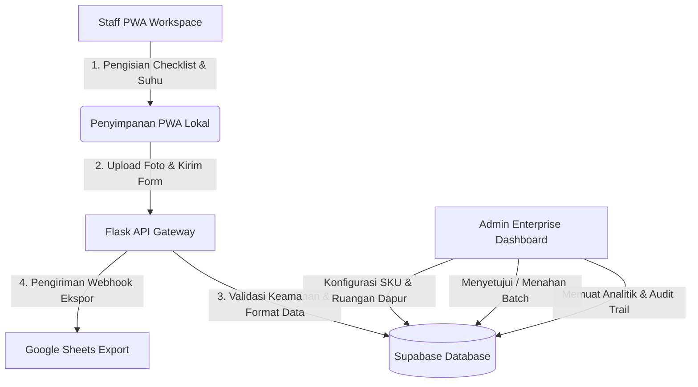

# Aplikasi Quality Control & Traceability Central Kitchen 🚀

Sistem manajemen kepatuhan Quality Control (QC) dan HACCP modern yang dirancang khusus untuk dapur pusat (Central Kitchen), katering massal, dan lini produksi makanan. Aplikasi ini mendigitalkan pencatatan suhu area, pelacakan batch masak, inspeksi QC produk, penanganan temuan deviasi lapangan, serta ekspor data kepatuhan ke spreadsheet eksternal secara otomatis dan terintegrasi.

[](https://project-qc-mu.vercel.app/)
[](https://supabase.com)
[](https://flask.palletsprojects.com/)
[](https://web.dev/progressive-web-apps/)
[-brightgreen?style=flat-square)](https://pytest.org)

---

## 🔗 Tautan Aplikasi & Akun Uji Coba (Demo)

Aplikasi telah dideploy dan aktif sepenuhnya. Anda dapat mencobanya langsung melalui tautan berikut:
👉 **[project-qc-mu.vercel.app](https://project-qc-mu.vercel.app/)**

Untuk mempermudah peninjauan fitur oleh pihak manajemen, silakan gunakan akun demo yang telah disediakan di bawah ini:

### 👤 1. Akun Demo Admin (Hanya Lihat / Read-Only)
Gunakan akun ini untuk melihat dashboard pemantauan pusat, menelusuri riwayat batch produksi, memeriksa diagram analitik, serta melihat riwayat aktivitas sistem (audit trail). Demi keamanan data demo, semua perintah modifikasi (tambah/edit/hapus) dikunci secara aman.
*   **Username:** `demo_admin`
*   **Password:** `demoadmin123`
*   **Hak Akses:** Hanya Lihat (Save/Update/Delete dinonaktifkan dengan notifikasi peringatan jika dicoba).

### 👷 2. Akun Demo Staff (Bisa Input & Edit / Read-Write)
Gunakan akun ini untuk mencoba alur kerja staff QC langsung di area dapur. Anda bisa mencatatkan log suhu slot harian, membuat nomor batch masakan, melakukan pengecekan mutu produk (QC Check), dan mencoba menu navigasi pintas.
*   **Username:** `demo_staff`
*   **Password:** `demostaff123`
*   **Hak Akses:** Bisa Input & Edit (Diizinkan penuh untuk mengisi checklist QC dan membuat data simulasi).

### 🗄️ 3. Akun Database Bawaan (Legacy / Seed)
Jika Anda mengatur ulang atau memuat database lokal menggunakan data bawaan (`001_demo_seed.sql`), Anda dapat menggunakan akun berikut:
*   **Admin:** `demo.admin@qcenterprise.id` (password: `demo123456`)
*   **Staff:** `demo.staff@qcenterprise.id` (password: `demo123456`)

---


## 🌟 Arsitektur Sistem Utama



---

## ✨ Fitur Utama Sistem

### 📊 Dashboard & Panel Kontrol Admin
*   **Analitik Real-Time**: Diagram visual interaktif yang merangkum tingkat kelulusan QC, statistik deviasi suhu ruangan, serta jumlah temuan kendala yang belum diselesaikan.
*   **Penelusuran Riwayat (Traceability)**: Log audit komprehensif yang melacak aktivitas pengguna secara detail untuk menjaga akuntabilitas data dapur.
*   **Validasi Kelayakan Batch**: Antarmuka bagi manajer untuk menentukan status akhir produk (menyetujui, menolak, atau menahan batch produksi sementara).
*   **Manajemen Konfigurasi**: Kemudahan mendaftarkan produk baru (SKU), menentukan masa kedaluwarsa produk secara dinamis, mengelola hak akses akun staff, serta mengatur tata letak ruangan dapur.

### 📱 Alur Kerja Staff Mobile-First (PWA)
*   **Dukungan Offline (Service Worker)**: Cache khusus berteknologi *Network-First* yang menjamin aplikasi tetap dapat diakses di area dapur dengan sinyal buruk dan langsung memperbarui data secara instan saat kembali online.
*   **Pengisian Suhu Slot Harian Fleksibel**: Menampilkan empat slot waktu utama (07:00, 13:00, 16:00, 19:00). Staff dapat mengeklik slot waktu mana pun yang belum diisi untuk melengkapi data pemantauan harian tanpa takut terkunci, dengan dukungan pengisian ulang (recheck) untuk tindakan perbaikan.
*   **Pengambilan Foto Bukti Fleksibel (Hybrid Picker)**: Laci menu popup bawah yang mempermudah staff memilih antara memotret langsung via **Kamera HP** atau mengunggah gambar yang sudah ada lewat **Galeri File**.
*   **Kompresi Gambar Otomatis**: Memperkecil ukuran foto secara otomatis di browser sebelum proses unggah agar hemat kuota internet dan mempercepat waktu pengiriman.
*   **Pemindai OCR Barcode**: Membaca tanggal produksi secara otomatis dari barcode kemasan untuk meminimalisir kesalahan ketik staff lapangan.
*   **Menu Navigasi Pintas Cepat (FAB Menu)**: Tombol melayang di sudut kanan bawah yang secara pintar menyembunyikan opsi halaman aktif saat ini dan memudahkan navigasi silang antarmodul secara cepat.

---

## 🛠️ Teknologi & Pola Desain (Tech Stack)

*   **Frontend**: Vanilla HTML5 dan CSS3 murni tanpa framework eksternal untuk performa maksimal. Desain visual menggunakan tipografi Google Fonts (Outfit, Inter) dengan transisi animasi halus dan tata letak responsif flex/grid. Ikon dinamis disuplai oleh FontAwesome dan notifikasi toast menggunakan Lucide SVG.
*   **Backend**: Web API berbasis Python Flask dengan sistem pengaman token JWT, middleware validasi payload, penanganan CORS, dan manajemen sesi pengguna.
*   **Database**: Supabase PostgreSQL dengan relasi kunci asing (foreign key), trigger otomatis, dan skrip inisialisasi data (seed data).
*   **Unit Tests**: Pengujian otomatis menggunakan `pytest` yang mencakup validasi hak akses per-role, sinkronisasi profil, pengisian log suhu, dan pengujian duplikasi data.

---

## 🔌 Sinkronisasi Webhook ke Google Sheets

Aplikasi ini mendukung ekspor data otomatis dari database ke spreadsheet eksternal melalui Google Apps Script Web App. 

Header kolom spreadsheet yang digunakan untuk sinkronisasi data **QC Temuan** adalah:
`Timestamp`, `Type`, `Staff`, `Temuan`, `Foto URL`, `Status`, `Source Type`, `Source ID`.

Format payload pengiriman temuan menggunakan field:
*   `data.finding_description` (Berisi penjelasan temuan kendala/deviasi)
*   `data.staff_name` (Nama staff yang melaporkan kendala)

---

## 🧪 Cara Menjalankan Pengujian Otomatis

Untuk memastikan kestabilan seluruh endpoint API dan validasi role, jalankan suite pengujian menggunakan pytest:
```bash
pytest
```
Atau jalankan file pengujian spesifik secara terpisah:
```bash
python -m pytest tests/test_demo_accounts.py tests/test_admin_products.py
```

---

## 🛣️ Rencana Pengembangan (Roadmap)

*   Integrasi sensor suhu berbasis IoT untuk pencatatan otomatis tanpa termometer fisik.
*   Notifikasi alert otomatis via WhatsApp jika terjadi deviasi suhu kritis atau batch gagal.
*   Deteksi anomali suhu dan perkiraan risiko kerusakan produk berbasis kecerdasan buatan (AI).
*   Fitur ekspor laporan harian dapur dalam format dokumen PDF/Excel.

---

## 📄 Penulis & Lisensi

*   **Rio Mikail**
