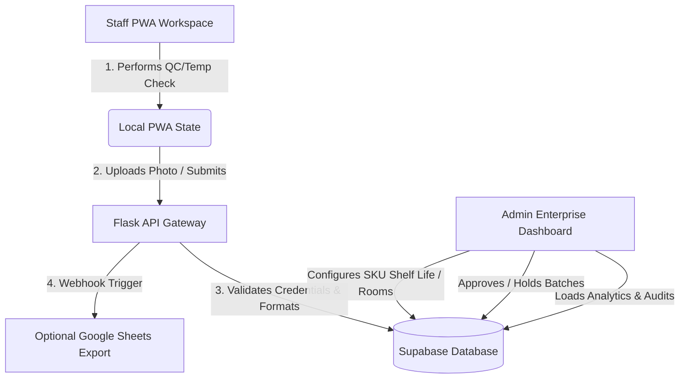

# AstroQC - Enterprise Quality Control & Traceability System 🚀
## QC Enterprise - Quality Control & Traceability System for Central Kitchen

A modern, mobile-first, and highly-secure Quality Control (QC) & HACCP compliance suite designed for central kitchens, food production lines, and caterers. This project digitizes temperature logs, batch tracking, product inspections, and compliance training into a unified enterprise platform.

[](https://project-qc-mu.vercel.app/)
[](https://supabase.com)
[](https://flask.palletsprojects.com/)
[](https://web.dev/progressive-web-apps/)
[-brightgreen?style=flat-square)](https://pytest.org)

---

## 🔗 Live Application & Demo Accounts

The application is deployed and fully active. You can access the live instance here:
👉 **[astro-qc.vercel.app](https://project-qc-mu.vercel.app/)**

To present this project to stakeholders, recruiters, or post on LinkedIn, use the following pre-configured credentials:

### 👤 1. Admin Demo Account (Read-Only)
Experience the enterprise management panel, trace batches, review logs, and examine audit trails. All modifying requests (POST, PATCH, PUT, DELETE) are securely locked for demonstration safety.
*   **Username:** `demo_admin`
*   **Password:** `demoadmin123`
*   **Permission:** View Only (Saves, updates, and deletes are disabled with error popups).

### 👷 2. Staff Demo Account (Read-Write)
Experience the PWA-enabled staff workspace on mobile or desktop. Log temperature readings, create batches, perform inspections, scan barcodes, and register food checks.
*   **Username:** `demo_staff`
*   **Password:** `demostaff123`
*   **Permission:** Read-Write (Fully allowed to submit inspections and create mock data).

### 🗄️ 3. Legacy / Seed Database Accounts
If you reset/seed the database locally via `001_demo_seed.sql`, you can use these legacy accounts:
*   **Admin:** `demo.admin@qcenterprise.id` (password: `demo123456`)
*   **Staff:** `demo.staff@qcenterprise.id` (password: `demo123456`)

---

## 🌟 Core System Architecture



---

## ✨ Features & Showcases

### 📊 Admin enterprise dashboard
*   **Real-time Analytics**: High-fidelity charts summarizing inspection pass rates, temperature anomalies, and unresolved issues.
*   **End-to-End Traceability**: Full audit logs detailing who, when, and what changed for every production batch.
*   **Approval Gateways**: Standard workflow for managers to approve, reject, or put batches on temporary hold.
*   **Dynamic Customization**: Add new SKUs, configure custom shelf life days (e.g. 3, 4, 7, 14, 30, 60, 90 days), set up facility rooms, and manage staff accounts.

### 📱 Staff mobile-first QC workflow (PWA)
*   **Offline First**: Outfitted with a custom Network-First service worker cache. Static HTML, styles, and logic files update instantly when online and fallback gracefully offline.
*   **Automatic Expiry Calculation**: When inputting dates or scanning barcodes, the system dynamically calculates the Expiry Date based on the SKU's custom shelf life configured by the Admin.
*   **Interactive Camera & Compressions**: Built-in camera utility with high-efficiency frontend image compression to ensure fast photo uploads even under poor kitchen network conditions.
*   **OCR Scanning Support**: Auto-reads dates from barcodes and fills manufacturing forms automatically to prevent human data entry errors.

### 🎓 ITDV Learning Center (HACCP)
*   **Compliance Training Modules**: Interactive courses covering HACCP, sanitation protocols, and CCP (Critical Control Points) limits.
*   **Mini Quizzes & Evaluations**: Test staff understanding with localized questionnaires.
*   **Verified Certificates**: Grants dynamic verification certificates upon module completions to keep logs of staff compliance levels.

---

## 🛠️ Tech Stack & Design Patterns

*   **Frontend Architecture**: Vanilla HTML5/CSS3 with responsive flex/grid layouts. Tailored typography (Outfit, Inter) and custom interactive animations. Lucide SVG integration for toast notifications.
*   **Backend Architecture**: Python Flask with robust middleware handling JWT session validation, rate limiting, and CORS headers.
*   **Database**: Supabase PostgreSQL with real-time replication triggers, schema-level foreign key constraints, and seed data scripts.
*   **Unit Tests**: Comprehensive automated test suites using `pytest` covering authorization gates, profile syncs, products CRUD, and submission pipelines.

---

## 🚀 Local Development Setup

To run this project locally, follow these steps:

### 1. Clone the Repository
```bash
git clone <your-repository-url>
cd Project_QC
```

### 2. Configure Environment Variables
Copy the env template file:
```bash
copy .env.example .env
```
Fill in your Supabase variables and JWT keys:
```env
JWT_SECRET_KEY=your-jwt-secret-key-here
JWT_ISSUER=qc-traceability-api
SUPABASE_URL=https://your-supabase-project.supabase.co
SUPABASE_SERVICE_ROLE_KEY=your-supabase-service-role-key-here
SUPABASE_STORAGE_BUCKET=qc-evidence
```

### 3. Install Dependencies & Setup Virtual Environment
```bash
python -m venv .venv
# On Windows
.venv\Scripts\activate
# On macOS/Linux
source .venv/bin/activate

pip install -r requirements.txt
```

### 4. Start the Application
```bash
python api/app.py
```
Open your browser and navigate to:
*   Staff Portal: `http://localhost:5000/staff/login.html`
*   Admin Portal: `http://localhost:5000/admin/admin_panel.html`
*   Learning Center: `http://localhost:5000/learning/`

---

## 🔌 Google Apps Script Webhook Export

Backend dapat mengirim data log monitoring suhu dan QC inspection ke Google Apps Script Web App secara otomatis.

Tambahkan juga tab `QC Temuan` untuk sinkronisasi temuan lapangan dengan header kolom berikut:
`Timestamp`, `Type`, `Staff`, `Temuan`, `Foto URL`, `Status`, `Source Type`, `Source ID`.

Format payload data yang dikirimkan menggunakan field:
- `data.finding_description` (Deskripsi temuan)
- `data.staff_name` (Nama staff pelapor)

Jika Google Apps Script mengalami kendala, silakan cek log eksekusi.

---

## 🧪 Running Automated Tests

Run the full pytest suite to verify endpoints and security compliance:
```bash
pytest
```
Or run specific test modules:
```bash
python -m pytest tests/test_demo_accounts.py tests/test_admin_products.py
```

---

## 🛣️ Roadmap

*   IoT temperature integration
*   WhatsApp notification
*   AI anomaly detection
*   Export PDF report
*   Multi-tenant SaaS

---

## 📄 Author & License

*   **Author:** Rio Mikail
*   **LinkedIn Presentation Portfolio:** [Traceability & QC Enterprise Central Kitchen Solution](https://project-qc-mu.vercel.app/)
*   **License:** MIT License. Feel free to fork and customize for your catering/restaurant operations!
