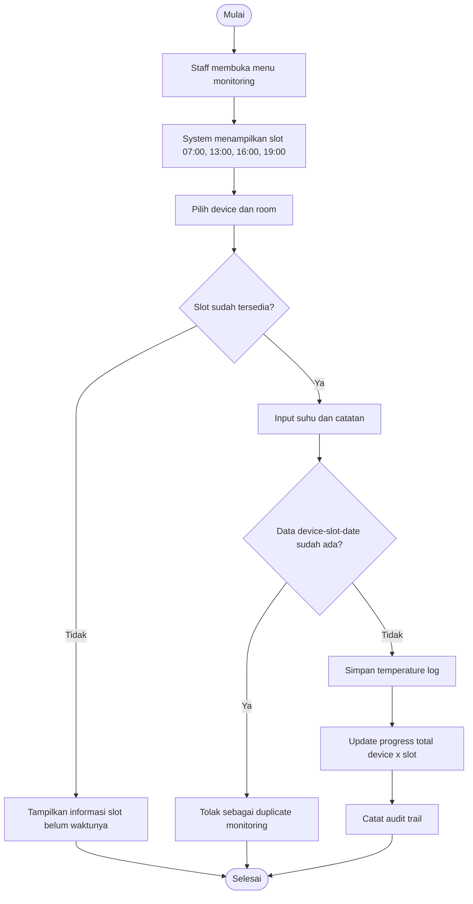
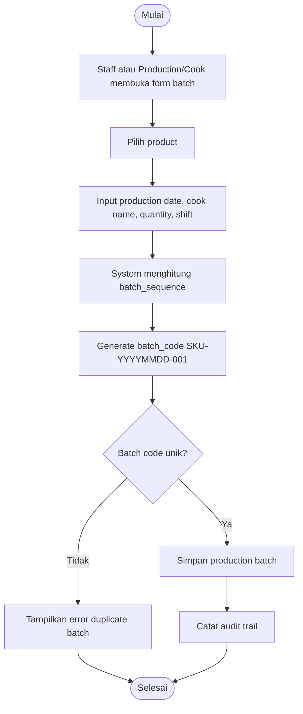
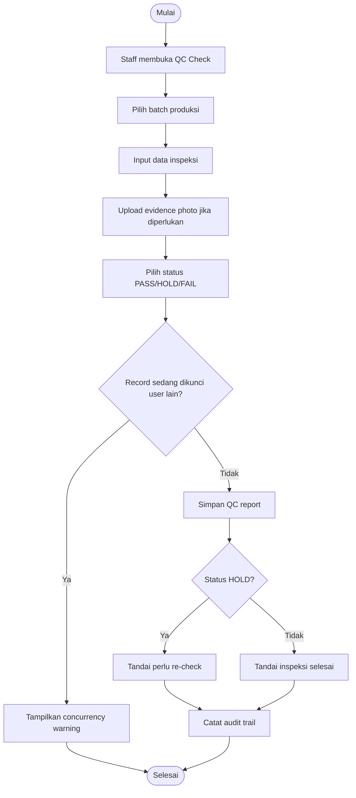

# Activity Diagram QC Enterprise

Dokumen ini menggambarkan alur aktivitas utama dalam QC Enterprise.

## Login Role Redirect

Alur ini menunjukkan proses login dan redirect berdasarkan role. Admin diarahkan ke dashboard admin, sedangkan staff diarahkan ke dashboard staff.

## Monitoring Suhu Harian

Alur ini memastikan monitoring suhu dilakukan berdasarkan slot harian dan per-device. Duplicate prevention menjaga agar satu device tidak disubmit lebih dari satu kali pada slot dan tanggal yang sama.

## Buat Batch Produksi

Alur ini menjelaskan bahwa satu batch merepresentasikan satu kali proses masak. Batch code digunakan untuk traceability produksi dan QC.

## QC Check

Alur ini mendukung keputusan QC dengan status PASS, HOLD, dan FAIL. Evidence photo dan concurrency lock membantu menjaga validitas data inspeksi.

## Re-check

Alur re-check menyimpan riwayat pemeriksaan ulang tanpa menghapus hasil inspeksi sebelumnya. Ini penting untuk audit dan traceability.

## Export Google Sheets

Alur ini menjelaskan proses export data dari QC Enterprise ke Google Sheets melalui Google Apps Script webhook. Export dapat dilakukan untuk data monitoring, QC, maupun re-export data lama berdasarkan rentang tanggal.
