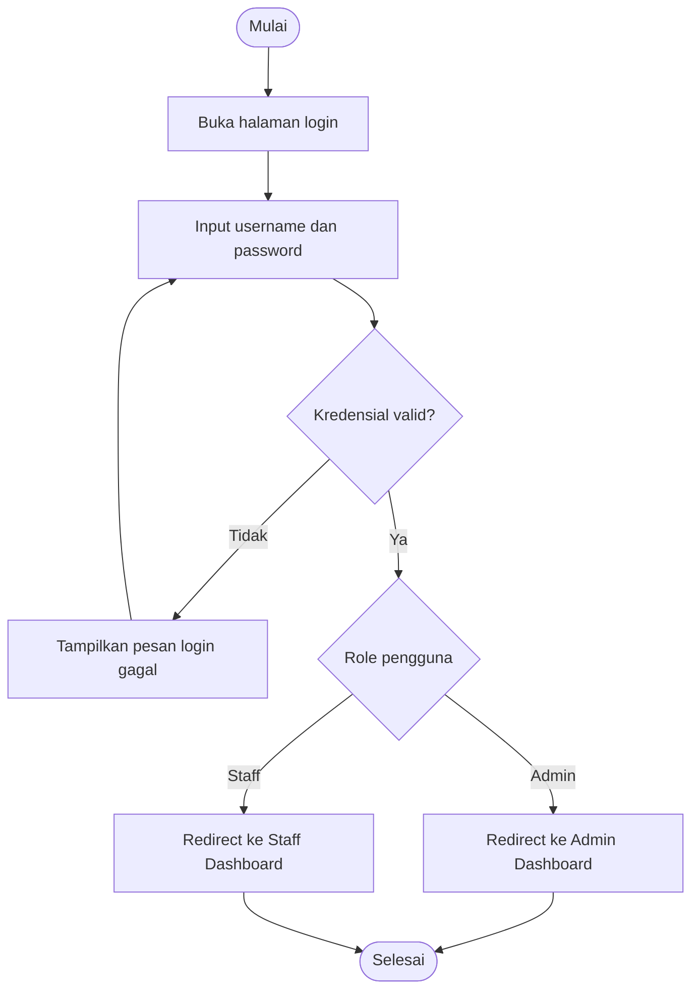
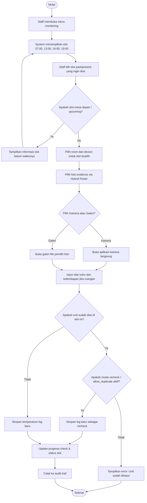
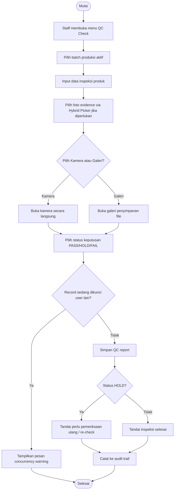
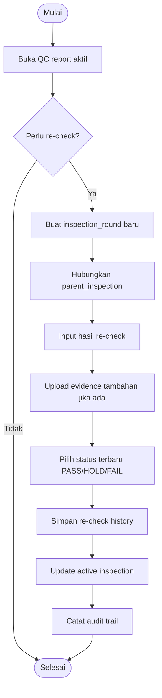
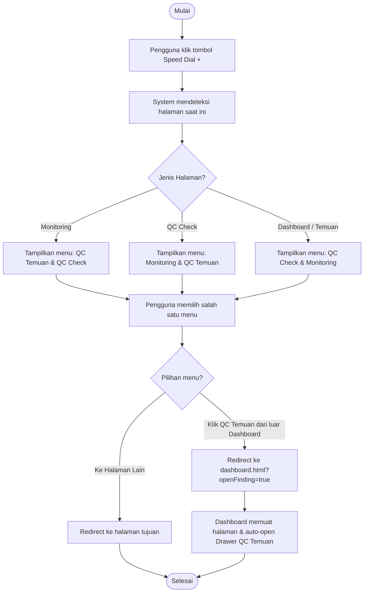
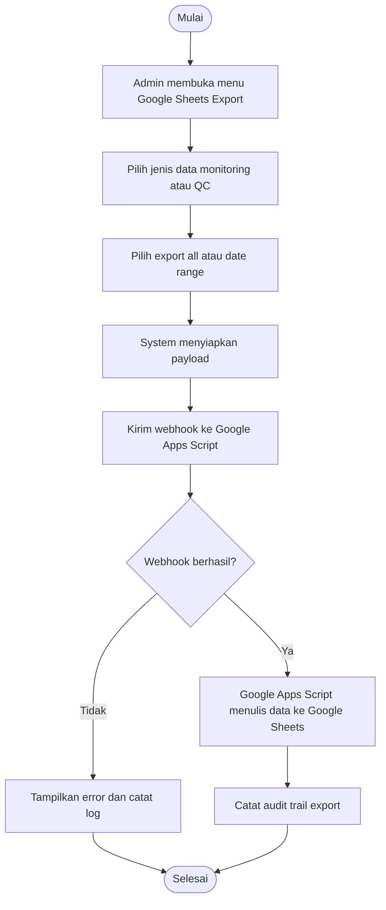

# Activity Diagram QC Central Kitchen

Dokumen ini menggambarkan alur aktivitas utama dalam QC Central Kitchen.

## Login Role Redirect

Alur ini menunjukkan proses login dan redirect berdasarkan role. Admin diarahkan ke dashboard admin, sedangkan staff diarahkan ke dashboard staff.

## Monitoring Suhu Harian (Dengan Clickable Slots & Recheck)

Alur ini memungkinkan staff memilih slot waktu secara fleksibel (07:00, 13:00, 16:00, 19:00). Duplicate prevention tetap berjalan, namun staff dapat menginput kembali (recheck) apabila sistem mengaktifkan parameter `allow_duplicate` untuk device tersebut.

## Buat Batch Produksi

Alur ini menjelaskan bahwa satu batch merepresentasikan satu kali proses masak. Batch code digunakan untuk traceability produksi dan QC.

## QC Check (Dengan Hybrid Photo Picker)

Alur ini mendukung keputusan QC dengan status PASS, HOLD, dan FAIL dengan dukungan opsi pengambilan foto fleksibel (Kamera / Galeri) dan concurrency lock pengaman.

## Re-check

Alur re-check menyimpan riwayat pemeriksaan ulang tanpa menghapus hasil inspeksi sebelumnya. Ini penting untuk audit dan traceability.

## Speed Dial FAB Menu & Navigation

Alur menu cepat (Speed Dial FAB) menampilkan opsi dinamis dengan menyembunyikan halaman aktif. Jika "QC Temuan" diklik dari luar dashboard, sistem melakukan redirect khusus agar drawer input temuan langsung terbuka di dashboard utama.

## Export Google Sheets

