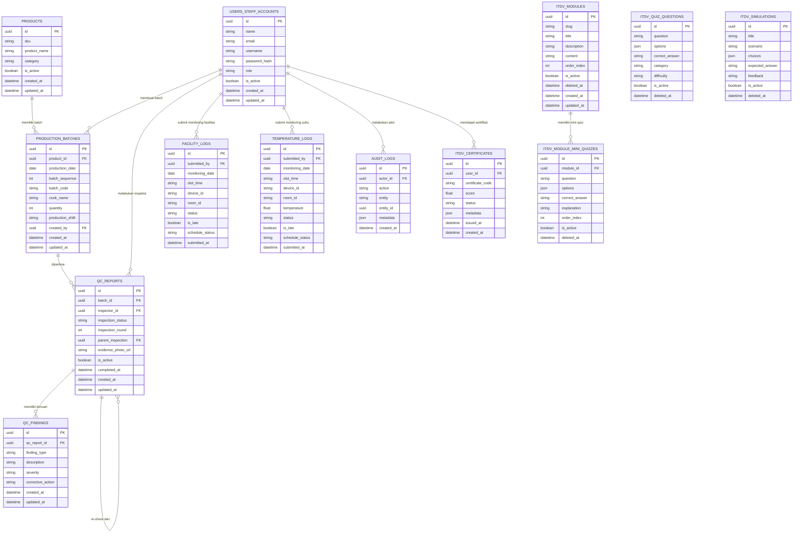

# ERD QC Enterprise

Dokumen ini menggambarkan rancangan relasi data utama pada QC Enterprise, sistem Quality Control Central Kitchen berbasis web.

## Entity Relationship Diagram

Diagram ini menunjukkan struktur data utama yang mendukung traceability QC Enterprise. Relasi penting meliputi produk ke batch produksi, batch ke QC report, QC report ke findings, user ke aktivitas monitoring, serta modul ITDV ke mini quiz dan sertifikat.
