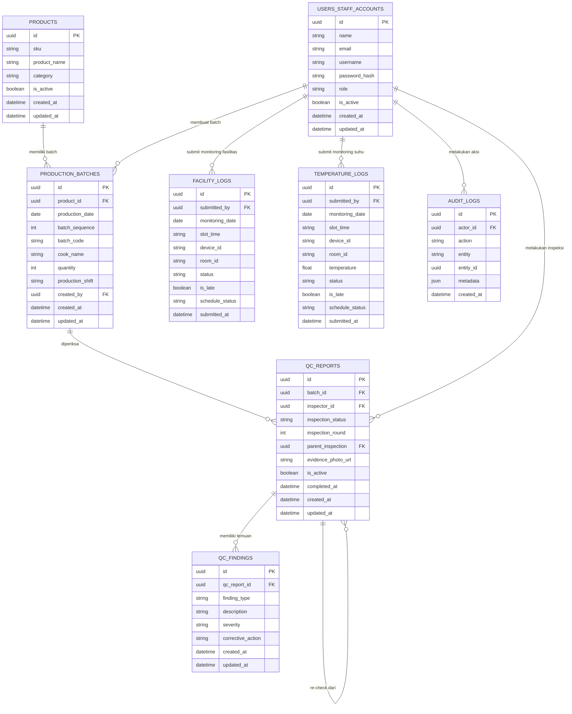

# ERD QC Central Kitchen

Dokumen ini menggambarkan rancangan relasi data utama pada QC Central Kitchen, sistem Quality Control Central Kitchen berbasis web.

## Entity Relationship Diagram

Diagram ini menunjukkan struktur data utama yang mendukung traceability QC Central Kitchen. Relasi penting meliputi produk ke batch produksi, batch ke QC report, QC report ke findings, user ke aktivitas monitoring suhu/fasilitas, serta catatan audit trail dari seluruh transaksi.
