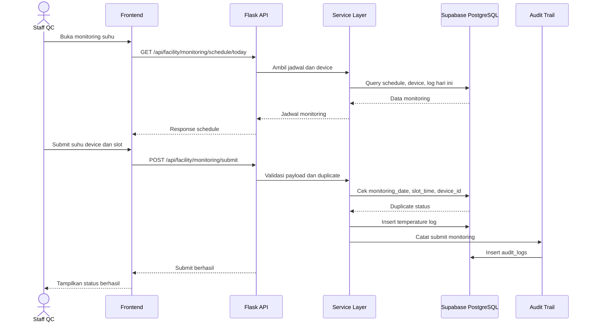
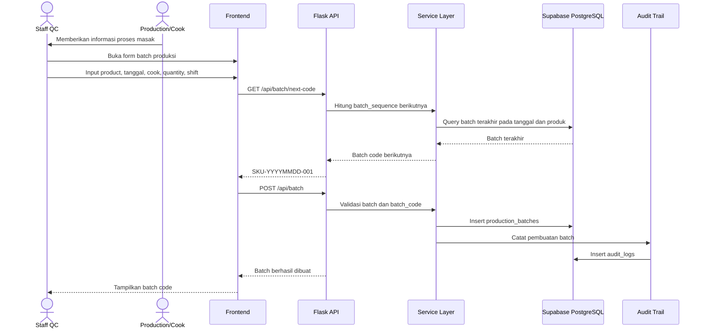
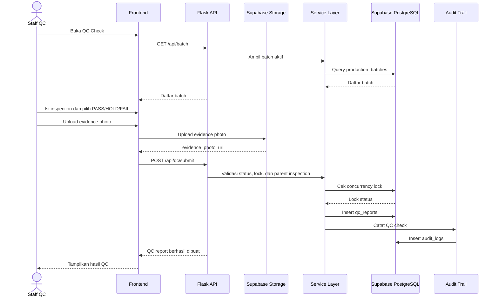
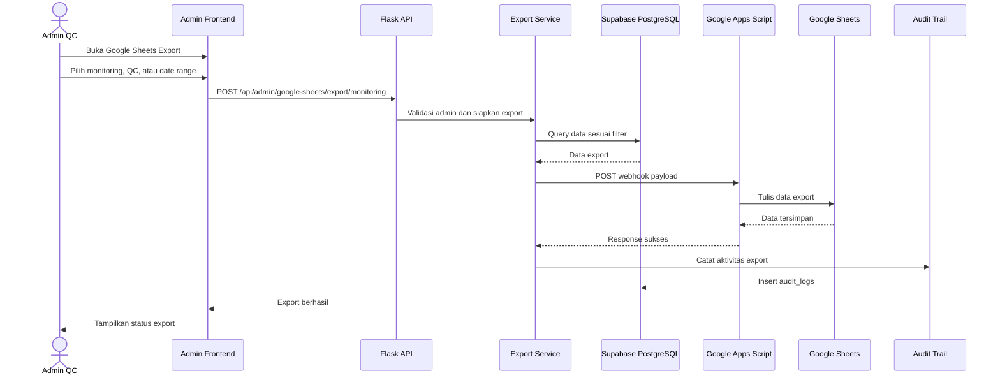

# Sequence Diagram QC Central Kitchen

Dokumen ini menggambarkan interaksi antar komponen pada workflow utama QC Central Kitchen.

## Staff Submit Monitoring

Sequence ini menunjukkan proses staff melakukan submit monitoring suhu. Validasi duplicate dilakukan berdasarkan tanggal, slot, dan device agar data monitoring tetap konsisten.

## Staff Buat Batch

Sequence ini menjelaskan pembuatan batch produksi. Batch code membantu menghubungkan proses masak dengan QC inspection dan reports.

## Staff Submit QC Check

Sequence ini menggambarkan submit QC check dengan evidence photo, status PASS/HOLD/FAIL, dan validasi concurrency lock untuk mencegah konflik update.

## Admin Export Google Sheets

Sequence ini menunjukkan export data ke Google Sheets melalui Google Apps Script. Admin dapat melakukan export data monitoring, QC, atau historical re-export berdasarkan filter.
