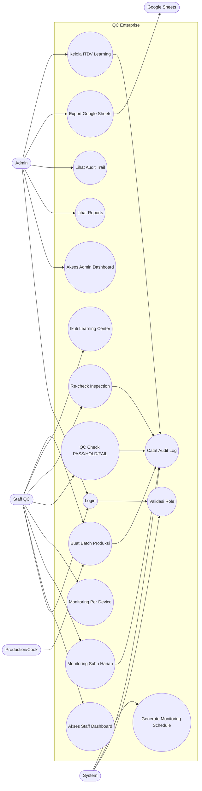

# Use Case Diagram QC Enterprise

Dokumen ini menggambarkan aktor dan use case utama pada QC Enterprise.

## Use Case Diagram

Diagram ini menjelaskan pembagian tanggung jawab antar aktor. Admin berfokus pada pengawasan, laporan, audit, export, dan pengelolaan learning. Staff QC berfokus pada input operasional seperti monitoring, QC check, batch, re-check, dan pembelajaran. System menjalankan validasi role, audit log, dan penjadwalan monitoring.
