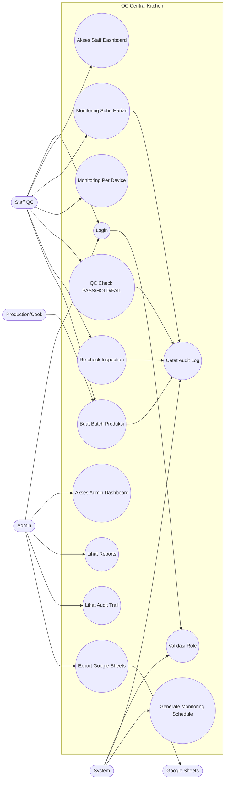

# Use Case Diagram QC Central Kitchen

Dokumen ini menggambarkan aktor dan use case utama pada QC Central Kitchen.

## Use Case Diagram

Diagram ini menjelaskan pembagian tanggung jawab antar aktor. Admin berfokus pada pengawasan, laporan, audit, dan export data. Staff QC berfokus pada input operasional seperti monitoring harian, QC check, pembuatan batch, dan re-check. System menjalankan fungsi internal otomatis seperti validasi role, pencatatan audit log, dan penjadwalan monitoring otomatis.
