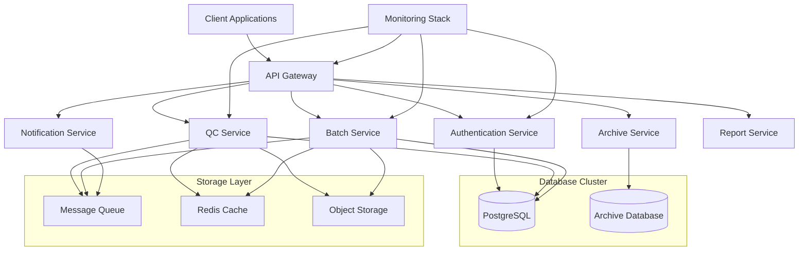
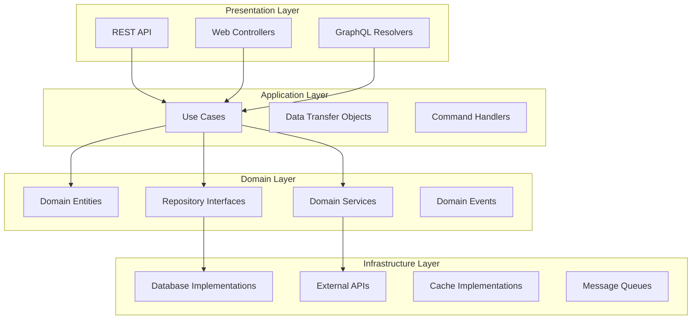
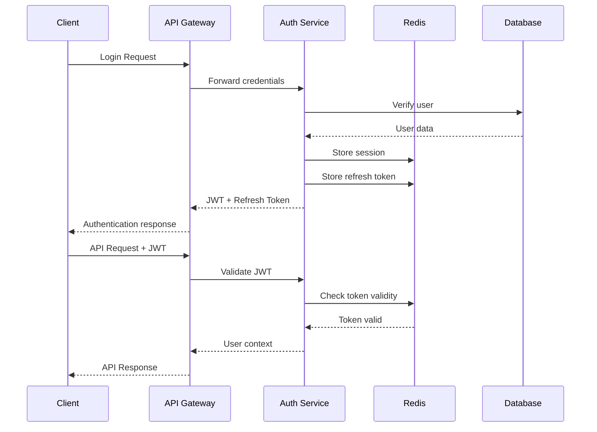

# Enterprise Architecture Design - QC Central Kitchen System

## System Architecture Overview

### High-Level Architecture

```
┌─────────────────────────────────────────────────────────────────┐
│                    Client Layer                                 │
│  ┌─────────────┐  ┌─────────────┐  ┌─────────────┐               │
│  │   Web App   │  │   Mobile    │  │   External  │               │
│  │  (React)    │  │   Apps      │  │   APIs      │               │
│  └─────────────┘  └─────────────┘  └─────────────┘               │
└─────────────────────────────────────────────────────────────────┘
                              │
                    ┌─────────▼─────────┐
                    │   API Gateway     │
                    │   (Kong/Nginx)    │
                    │  • Load Balancing │
                    │  • Rate Limiting  │
                    │  • Authentication│
                    └─────────┬─────────┘
                              │
┌────────────────────────────┼────────────────────────────────────┐
│                    Backend Services Layer                        │
│  ┌─────────────┐  ┌─────────────┐  ┌─────────────┐               │
│  │  Auth Service│  │  QC Service │  │ Batch Service│              │
│  │ (Microservice)│  │ (Microservice)│  │ (Microservice)│             │
│  └─────────────┘  └─────────────┘  └─────────────┘               │
│  ┌─────────────┐  ┌─────────────┐  ┌─────────────┐               │
│  │   Archive   │  │  Notification│  │   Report    │               │
│  │   Service   │  │   Service   │  │   Service   │               │
│  └─────────────┘  └─────────────┘  └─────────────┘               │
└────────────────────────────┼────────────────────────────────────┘
                              │
                    ┌─────────▼─────────┐
                    │   Message Queue   │
                    │    (Redis/Amazon  │
                    │     SQS/Kafka)    │
                    └─────────┬─────────┘
                              │
┌────────────────────────────┼────────────────────────────────────┐
│                    Data & Storage Layer                          │
│  ┌─────────────┐  ┌─────────────┐  ┌─────────────┐               │
│  │ PostgreSQL  │  │   Supabase  │  │   File Share │               │
│  │  (Primary)  │  │ (Analytics) │  │   (Archives) │              │
│  └─────────────┘  └─────────────┘  └─────────────┘               │
│  ┌─────────────┐  ┌─────────────┐  ┌─────────────┐               │
│  │    Redis    │  │   S3/MinIO  │  │   Backup    │               │
│  │   (Cache)   │  │   (Object)  │  │   Storage   │               │
│  └─────────────┘  └─────────────┘  └─────────────┘               │
└─────────────────────────────────────────────────────────────────┘
                              │
                    ┌─────────▼─────────┐
                    │   Monitoring &    │
                    │   Observability   │
                    │  • Prometheus     │
                    │  • Grafana        │
                    │  • ELK Stack      │
                    │  • Sentry         │
                    └───────────────────┘
```

### Microservices Architecture



## Technology Stack

### Backend Architecture

#### Core Frameworks
- **Flask 3.0+**: Web framework with Blueprint architecture
- **SQLAlchemy 2.0+**: ORM with async support
- **Alembic**: Database migration tool
- **Celery**: Distributed task queue
- **Redis**: Caching and message broker

#### Security Stack
- **Supabase Auth**: Authentication & Authorization
- **JWT**: Token-based authentication
- **OWASP Security**: Security best practices
- **Rate Limiting**: DDoS protection

#### Database Architecture
- **PostgreSQL 15+**: Primary database
- **Supabase**: Real-time subscriptions
- **Redis**: Session store and cache
- **Read Replicas**: High availability setup

#### Infrastructure
- **Docker**: Containerization
- **Kubernetes**: Orchestration
- **Nginx**: Reverse proxy and load balancer
- **Kong**: API gateway with plugins

### Frontend Architecture

#### Core Technologies
- **React 18+**: Component-based UI
- **TypeScript**: Type safety
- **Vite**: Build tooling
- **Tailwind CSS**: Utility-first styling

#### State Management
- **Zustand**: Lightweight state management
- **React Query**: Server state management
- **SWR**: Data fetching library

#### Performance Optimization
- **Code Splitting**: Lazy loading
- **Service Workers**: Offline support
- **CDN**: Static asset delivery

## Clean Architecture Implementation

### Layer Structure



### Domain-Driven Design (DDD)

#### Core Domains
```python
# Quality Control Domain
class QCDomain:
    """Core QC business logic and rules"""
    
class Batch:
    """Batch operations and lifecycle"""
    
class Product:
    """Product specifications and requirements"""
    
class Facility:
    """Facility management and operations"""

class Staff:
    """Staff management and access control"""

class Audit:
    """Audit trail and compliance"""
```

#### Bounded Contexts
- **Quality Control**: Core QC operations and validation
- **Batch Management**: Batch lifecycle and tracking
- **Staff Management**: Authentication and authorization
- **Reporting**: Reports and analytics
- **Archive**: Historical data management
- **Notifications**: Alerts and messaging

## Scalability Patterns

### Database Scalability

#### Partitioning Strategy
```sql
-- Audit Logs Partitioning
CREATE TABLE audit_logs (
    id BIGSERIAL,
    created_at TIMESTAMPTZ NOT NULL,
    facility_id UUID NOT NULL,
    event_type VARCHAR(50) NOT NULL,
    metadata JSONB
) PARTITION BY RANGE (created_at);

-- Monthly partitions
CREATE TABLE audit_logs_2024_01 PARTITION OF audit_logs
    FOR VALUES FROM ('2024-01-01') TO ('2024-02-01');

-- Facility-based partitioning for large tables
CREATE TABLE qc_records (
    id BIGSERIAL,
    facility_id UUID NOT NULL,
    -- other columns
) PARTITION BY HASH (facility_id);
```

#### Indexing Strategy
```sql
-- Performance-critical indexes
CREATE INDEX CONCURRENTLY idx_qc_records_facility_status 
    ON qc_records(facility_id, status) 
    WHERE status IN ('active', 'pending');

-- Composite indexes for common queries
CREATE INDEX CONCURRENTLY idx_qc_records_batch_time 
    ON qc_records(batch_id, recorded_at DESC);

-- Partial indexes for active data
CREATE INDEX CONCURRENTLY idx_active_batches 
    ON batches(facility_id, created_at DESC) 
    WHERE status = 'active';
```

### Caching Strategy

#### Multi-Level Caching
```python
# Redis caching implementation
class CacheStrategy:
    """Multi-level caching with Redis"""
    
    def __init__(self):
        self.redis_client = redis.Redis()
        self.local_cache = {}
        
    async def get_qc_data(self, key: str):
        # Level 1: Local memory cache
        if key in self.local_cache:
            return self.local_cache[key]
            
        # Level 2: Redis cache
        cached_data = await self.redis_client.get(key)
        if cached_data:
            self.local_cache[key] = cached_data
            return cached_data
            
        # Level 3: Database
        data = await self.fetch_from_db(key)
        await self.redis_client.setex(key, 3600, data)
        self.local_cache[key] = data
        return data
```

## Security Architecture

### Authentication Flow



### Security Layers

#### Network Security
- **TLS 1.3**: Encryption in transit
- **mTLS**: Service-to-service authentication
- **VPC**: Network isolation
- **WAF**: Web application firewall

#### Application Security
- **Input Validation**: OWASP standards
- **Rate Limiting**: DDoS protection
- **CORS**: Cross-origin resource sharing
- **CSRF Protection**: Cross-site request forgery

#### Data Security
- **Encryption at Rest**: Database encryption
- **Field-level Encryption**: Sensitive data
- **Data Masking**: PII protection
- **Audit Logging**: Access tracking

## Deployment Architecture

### Container Strategy

```yaml
# Kubernetes Deployment Strategy
apiVersion: apps/v1
kind: Deployment
metadata:
  name: qc-service
spec:
  replicas: 3
  strategy:
    type: RollingUpdate
    rollingUpdate:
      maxSurge: 1
      maxUnavailable: 0
  selector:
    matchLabels:
      app: qc-service
  template:
    metadata:
      labels:
        app: qc-service
    spec:
      containers:
      - name: qc-service
        image: qc-system/backend:latest
        ports:
        - containerPort: 5000
        env:
        - name: DATABASE_URL
          valueFrom:
            secretKeyRef:
              name: db-secret
              key: url
        resources:
          requests:
            memory: "256Mi"
            cpu: "250m"
          limits:
            memory: "512Mi"
            cpu: "500m"
        livenessProbe:
          httpGet:
            path: /health
            port: 5000
          initialDelaySeconds: 30
          periodSeconds: 10
        readinessProbe:
          httpGet:
            path: /ready
            port: 5000
          initialDelaySeconds: 5
          periodSeconds: 5
```

### CI/CD Pipeline

```yaml
# GitHub Actions Workflow
name: Deploy to Production
on:
  push:
    branches: [main]

jobs:
  test:
    runs-on: ubuntu-latest
    steps:
      - uses: actions/checkout@v3
      - name: Run Tests
        run: |
          docker-compose -f docker-compose.test.yml up
          docker-compose -f docker-compose.test.yml run --rm pytest
          
  build:
    needs: test
    runs-on: ubuntu-latest
    steps:
      - uses: actions/checkout@v3
      - name: Build Image
        run: docker build -t qc-system/backend:${{ github.sha }} .
      - name: Push to Registry
        run: |
          docker push qc-system/backend:${{ github.sha }}
          docker tag qc-system/backend:${{ github.sha }} qc-system/backend:latest
          docker push qc-system/backend:latest
          
  deploy:
    needs: build
    runs-on: ubuntu-latest
    steps:
      - name: Deploy to Production
        run: |
          kubectl set image deployment/qc-service \
            qc-service=qc-system/backend:${{ github.sha }}
          kubectl rollout status deployment/qc-service
```

## Monitoring & Observability

### Metrics Collection

```python
# Prometheus Metrics Integration
from prometheus_client import Counter, Histogram, Gauge

# Business metrics
qc_operations_total = Counter(
    'qc_operations_total',
    'Total QC operations performed',
    ['facility_id', 'operation_type', 'status']
)

qc_response_time = Histogram(
    'qc_response_time_seconds',
    'QC operation response time',
    ['operation', 'facility_id']
)

active_sessions = Gauge(
    'active_sessions_total',
    'Number of active user sessions',
    ['facility_id']
)

# System metrics
from prometheus_client import generate_latest

@app.route('/metrics')
def metrics():
    """Prometheus metrics endpoint"""
    return Response(generate_latest(), mimetype='text/plain')
```

### Logging Strategy

```python
# Structured Logging
import structlog

logger = structlog.get_logger()

@app.before_request
def log_request():
    """Log incoming requests"""
    logger.info(
        "request_received",
        method=request.method,
        path=request.path,
        user_id=request.user_id,
        facility_id=request.facility_id
    )

@app.after_request
def log_response(response):
    """Log responses"""
    logger.info(
        "request_completed",
        status=response.status_code,
        duration=response.elapsed
    )
    return response
```

## Performance Optimization

### Database Optimization

#### Query Optimization
```sql
-- Optimized queries for performance
EXPLAIN (ANALYZE, BUFFERS) 
SELECT qr.id, qr.status, qr.recorded_at
FROM qc_records qr
WHERE qr.facility_id = $1 
  AND qr.recorded_at >= $2
  AND qr.status = 'active'
ORDER BY qr.recorded_at DESC
LIMIT 100;

-- Materialized views for reporting
CREATE MATERIALIZED VIEW facility_qc_summary AS
SELECT 
    facility_id,
    DATE_TRUNC('day', recorded_at) as date,
    COUNT(*) as total_checks,
    COUNT(*) FILTER (WHERE status = 'pass') as pass_count,
    COUNT(*) FILTER (WHERE status = 'fail') as fail_count
FROM qc_records
GROUP BY facility_id, DATE_TRUNC('day', recorded_at);
```

### Application Optimization

#### Async Processing
```python
# Async task processing
from celery import Celery
from .models import QCRecord

app = Celery('qc_system')

@app.task(bind=True, max_retries=3)
def process_qc_async(self, qc_record_id):
    """Process QC record asynchronously"""
    try:
        record = QCRecord.get(qc_record_id)
        # Process the record
        result = perform_qc_validation(record)
        
        # Send notifications
        send_notification.delay(result)
        
        return result
        
    except Exception as exc:
        # Retry with exponential backoff
        raise self.retry(exc=exc, countdown=60 * (2 ** self.request.retries))
```

## Disaster Recovery & Business Continuity

### Backup Strategy
- **Automated Backups**: Daily incremental, weekly full
- **Cross-Region Replication**: Multi-AZ deployment
- **Point-in-Time Recovery**: 30-day retention
- **Backup Validation**: Automated restore testing

### High Availability
- **Multi-AZ Deployment**: Geographic redundancy
- **Health Checks**: Automated monitoring
- **Auto-Failover**: Automatic service failover
- **Data Consistency**: Strong consistency guarantees

---

This architecture design provides a scalable, secure, and maintainable foundation for the QC Central Kitchen enterprise system. The implementation follows industry best practices and is designed for multi-tenant, multi-branch operations with high throughput requirements.